# VALOR Ecosysteem
## Een Epistemisch Platform voor Waardegedreven Publieke Dienstverlening

**Versie** | 2.1
**Datum** | maart 2026
**Status** | Concept — ter besluitvorming

---

## 1. Visie en Positionering

### 1.1 Het probleem

Maatschappelijke vraagstukken — schuldenproblematiek, klimaatadaptatie, zorgtoegankelijkheid, digitale inclusie — zijn per definitie complex. Ze kennen meerdere oorzaken, raken meerdere belangen, worden beoordeeld vanuit meerdere waarden, en vragen om oplossingen die juridisch houdbaar, procesmatig uitvoerbaar en democratisch legitiem zijn. Tegelijkertijd zijn de mensen die aan die oplossingen werken zelden experts op alle relevante domeinen tegelijk: een beleidsmedewerker kent de juridische context maar niet de systeemwereld; een burger kent de leefwereld maar niet de wetgeving; een ontwerper kent de gebruikerservaring maar niet de ontologische structuur van het domein.

Bestaande tools voor beleidsontwerp, participatie en kennismanagement behandelen deze perspectieven als aparte werelden. Een causaal diagram in Vensim communiceert niet met een stakeholderanalyse in Miro, die niet communiceert met een juridisch advies in Word, die niet communiceert met een procesontwerp in BPMN. De kennis die in elk van die tools is opgebouwd, blijft geïsoleerd. Verbanden worden niet gelegd. Spanningen blijven onzichtbaar. Beslissingen worden genomen zonder de consequenties in andere perspectieven te overzien.

Het gevolg: oplossingen die juridisch kloppen maar de verkeerde oorzaken adresseren. Processen die efficiënt zijn maar waarden schenden. Interventies die voor betrokkenen onbegrijpelijk zijn omdat de rationale verloren is gegaan. En — een blinde vlek die zelden expliciet wordt — ontwerpen die principieel onuitvoerbaar zijn omdat de vereiste capabilities bij de uitvoerende organisaties ontbreken.

### 1.2 De VALOR-visie

VALOR is een epistemisch platform voor het gezamenlijk ontwerpen van oplossingen voor maatschappelijke vraagstukken. Het integreert meerdere perspectieven op hetzelfde ontologische fundament, zodat verbanden tussen perspectieven zichtbaar zijn, spanning ertussen bespreekbaar wordt, en beslissingen traceerbaar worden vastgelegd.

De kern van VALOR is een radicale architectuurkeuze: **alle perspectieven zijn van meet af aan uitgedrukt in dezelfde ontologische taal** — gUFO, de Gentle Unified Foundational Ontology. Een causaal gevolg is een `gufo:Situation`. Een stakeholder is een `gufo:Agent`. Een norm is een sociaal object uit UFO-L. Er is geen vertaling nodig tussen perspectieven, omdat ze allemaal op hetzelfde fundament zijn gebouwd. Wat wél verschilt per perspectief is uitsluitend de presentatie: de visuele taal, de terminologie, de interactiepatronen die aansluiten bij de denk- en werkwijze van de deelnemers.

Elk modelleerelement in VALOR is een **claim over de werkelijkheid** — een bewering over hoe de wereld is (as-is) of zou moeten worden (to-be). Claims kunnen worden voorgesteld, betwist, onderbouwd met bewijs, aangenomen of verworpen. Faseovergangen en definitieve ontwerpkeuzes zijn formele besluitvormingsmomenten waaraan deelnemers democratisch bijdragen.

Een kernbelofte van VALOR is dat ontwerpalternatieven langs vier dimensies vergelijkbaar zijn: **waardeconsistentie** (Axia), **juridische houdbaarheid** (Lexa), **uitvoerbaarheid** (CAPAX), en **theoretische adequaatheid** (CAUSA). De vierde dimensie is het meest onderscheidende: een ontwerp dat uitvoerbaar is maar de manifesteringscondities van zijn eigen beleidstheorie niet realiseert, bevat een coherentiefout die in VALOR detecteerbaar en bespreekbaar is — onderscheid tussen een slecht ontwerp en een slechte beleidstheorie. De volledige redeneergeschiedenis van een ontwerp — welke claims zijn gemaakt, door wie, op basis van welk bewijs, met welke tegenwerpingen, en hoe is uiteindelijk besloten — is traceerbaar vastgelegd en te allen tijde te reconstrueren.

AI-agents nemen deel aan het ontwerpproces als **Socratische gesprekspartners**: deelnemers die door vragen stellen, alternatieven voorleggen en consequenties van keuzes zichtbaar maken de kwaliteit van het model verbeteren — zonder ooit te beslissen wat erin komt.

### 1.3 Wat VALOR niet is

VALOR is geen besluitvormingssysteem dat uitkomsten produceert. Het faciliteert het besluitvormingsproces, maar de beslissingen worden genomen door mensen. VALOR is geen experttool die alleen toegankelijk is voor ontologen of informatici. Deelnemers werken in hun eigen taal en perspectief, zonder kennis van de onderliggende ontologische structuur te hoeven verwerven. VALOR is geen neutraal registratiesysteem. Het is een actief epistemisch instrument: het maakt spanningen zichtbaar die anders verborgen zouden blijven, stelt vragen die anders niet gesteld zouden worden, en borgt dat de redenering achter een ontwerp niet verloren gaat.

### 1.4 Kernbegrippen

**Issue.** Een maatschappelijk vraagstuk: een situatie in de werkelijkheid die door betrokken partijen als problematisch wordt ervaren en om een gedeelde oplossing vraagt. In VALOR uitgedrukt als een `valor:Issue` — een `ufoc:SocialObject` dat bestaat doordat een `valor:IssueCommunity` een gedeeld `ufoc:Concern` heeft over een onderliggende `gufo:Situation` (de toestand van de wereld die als problematisch wordt ervaren). Een Issue is daarmee een sociaal construct — het bestaat doordat agents het als zodanig constitueren, niet door de toestand van de wereld zelf. De link naar die toestand wordt vastgelegd via `valor:concernedWithSituation`; de constitutieve relatie tot de community via `valor:hasConcernAbout`.

**IssueCommunity.** De gemeenschap van agents die samen een Issue constitueren door hun gedeeld Concern. Geformaliseerd als `valor:IssueCommunity` — een specialisatie van `valor:CollectiveIntentionalCommunity` in de *cognitieve modus*: ze bestaat zodra agents elkaars Concern wederzijds erkennen, zonder dat actie vereist is. De IssueCommunity is typisch breder dan de groep die het Issue daadwerkelijk aanpakt: burgers die schuldenproblematiek als problematisch ervaren zijn niet dezelfde agents als de schuldhulpverleners en gemeenten die de dienstverlening uitvoeren. De IssueCommunity is de **legitimeringsbron** van het ecosysteem dat handelt.

**Design Space.** De gestructureerde ontwerpomgeving voor één Issue. Bevat alle perspectieven, alle alternatieven, alle fasen, alle claims en alle besluitvormingsepisodes die betrekking hebben op dat Issue. Meerdere Design Spaces kunnen gelijktijdig actief zijn in VALOR.

**Perspectief.** Een gefocuste view op de ontologische graph van een Design Space, in de taal en visuele notatie die past bij een specifieke manier van denken over het Issue. VALOR kent zeven perspectieven: Causa, Lexa, Acta, Socia, Axia, Delibera en Forma (zie Hoofdstuk 4). Haalbaarheid (capabilities en gaps) is geen achtste perspectief maar een **geïntegreerde haalbaarheidslaag** die als overlay zichtbaar is binnen elk inhoudelijk perspectief en als gate-criterium verplicht is bij faseovergangen (zie §2.4 en §4.9).

**Fase.** Een afgebakende periode in de lifecycle van een Design Space, geïnspireerd op Design Thinking maar aanpasbaar per vraagstuk. Na elke fase wordt democratisch besloten welke elementen van het model worden meegenomen naar de volgende fase.

**Alternatief.** Een coherente verzameling to-be claims die een mogelijke oplossingsrichting beschrijft. Meerdere alternatieven kunnen parallel bestaan binnen een Design Space en onafhankelijk van elkaar worden uitgewerkt, maar delen een gemeenschappelijke as-is beschrijving van het Issue.

**Claim.** Elk modelleerelement in VALOR — elke node, relatie, kardinaliteit, waarde-oordeel — is een claim over de werkelijkheid. Claims hebben een epistemische status (voorgesteld, betwist, aangenomen, verworpen, heroverwogen) en kunnen worden onderbouwd met bewijs. De claim-structuur is het hart van VALOR's epistemische architectuur. Elke claim is een **Tessera**: een bouwsteen van het mozaïek dat het ontwerp vormt.

**Tessera.** De systeemnaam voor een claim als bouwsteen. Naar het Latijnse *tessera*: het tegeltje waarmee een Romein toegang kreeg tot een vergadering, en de bouwsteen van een mozaïek. Elke Tessera heeft een auteur, een tijdstempel, een epistemische status, een verzameling ondersteunend of weerleggend bewijs, en argumentatierelaties met andere Tesserae.

**Besluitvormingsepisode.** Een formeel moment waarop deelnemers democratisch besluiten over de epistemische status van een set Tesserae — bij een faseovergang of bij de vaststelling van een definitief ontwerp. Besluitvormingsepisodes zijn zelf gemodelleerd als `gufo:Event`-instanties met volledige provenance.

**Capability.** De dispositie van een actor (organisatie of individu) om een bepaald type transactie succesvol uit te voeren en daarmee de verwachte waarde voor de burger voort te brengen. In VALOR-O geformaliseerd als `capax:Capability` — een `gufo:Disposition` die inhereert aan een agent. Capabilities zijn geen doelen, rollen of processen: ze bestaan als potentialiteit ook wanneer ze niet worden gerealiseerd. Het ontbreken van een vereiste capability bij de actor die een transactie moet uitvoeren, constitueert een `capax:CapabilityGap` — een Tessera over de as-is werkelijkheid die formeel betwistbaar is en bij onvoldoende adressering een faseovergang blokkeert.

**EcosystemAgent.** Een coalitie van autonome, onafhankelijke organisaties die samenwerken aan een gedeelde publieke dienst zonder hiërarchisch gezag over elkaar. In VALOR-O geformaliseerd als `nexus:EcosystemAgent` — een specialisatie van `valor:CollectiveIntentionalCommunity` in de *conatieve modus*: geconstitueerd door een `nexus:CollaborationCommitment` (een Relator die normatieve verwachtingen vastlegt tussen leden), handelingsgericht, en gericht op het produceren van een `nexus:CollaborativeCapability`. De EcosystemAgent baseert zijn mandaat op de IssueCommunity die het Issue erkent dat hij adresseert — vastgelegd via `nexus:addressesIssue`. De capabilities van een EcosystemAgent zijn per definitie emergent: ze superveniëren op de configuratie van de samenwerkende organisaties en kunnen niet worden herleid tot de som van hun individuele capabilities.

**Socratische Agent.** Een AI-agent die deelneemt aan ontwerpprocessen als gesprekspartner zonder stemrecht. De agent stelt vragen, legt alternatieven voor, maakt gevolgen van keuzes zichtbaar — maar beslist nooit. Zie Hoofdstuk 5.

---

## 2. VALOR-O: De Basis-Ontologie

### 2.1 Architectuurprincipe

De basis-ontologie van VALOR — VALOR-O — is de gemeenschappelijke ontologische fundering waarop alle perspectieven, alle claims, alle besluitvormingsepisodes en alle ontwerpfasen zijn gebouwd. VALOR-O is een domeinontologie op ecosysteemniveau, gebouwd bovenop gUFO en een reeks UFO-extensies en aanvullende formaliseringen.

VALOR-O bestaat uit vijf lagen die van abstract naar concreet gaan:

```
┌─────────────────────────────────────────────────────────────┐
│  Laag 5: VALOR Toepassingsontologie                          │
│  (Issue, Design Space, Fase, Alternatief, Deelnemer)         │
├─────────────────────────────────────────────────────────────┤
│  Laag 4: Epistemische module                                 │
│  (Tessera, Bewijs, Argumentatie, Besluitvormingsepisode)     │
├─────────────────────────────────────────────────────────────┤
│  Laag 3: Domeinextensies (perspectief-ontologieën)           │
│  Causa · Lexa · Acta · Socia · Cover/Axia · Delibera        │
│  + Geïntegreerde haalbaarheidslaag (CAPAX · NEXUS)          │
├─────────────────────────────────────────────────────────────┤
│  Laag 2: UFO-extensies                                       │
│  UFO-B · UFO-C · UFO-L + Policy · COoDM · COVER · DEMO      │
├─────────────────────────────────────────────────────────────┤
│  Laag 1: gUFO + Systemistische grondlaag (SYSONT)           │
│  Taxonomy of Individuals + Taxonomy of Types                 │
│  System · Component · BondingRelation · SystemMoment        │
└─────────────────────────────────────────────────────────────┘
```

Alle perspectieven bevragen en beschrijven dezelfde VALOR-O graph via SPARQL-projecties. Er is geen aparte datastore per perspectief. Een `valor:Agent` (Socia) die een privacybelang heeft is exact dezelfde resource als de drager van dat belang in de Axia-view en de participant in een besluitvormingsepisode in Delibera.

### 2.2 Laag 1: gUFO en systemistische grondlaag (SYSONT)

**gUFO.** De onderste laag is gUFO v1.0 in zijn volledigheid: de Taxonomy of Individuals (Endurant, Event, Situation, AbstractIndividual en hun specialisaties) en de Taxonomy of Types (EndurantType, EventType, SituationType en de rigiditeits- en sortaliteitshiërarchie). gUFO fungeert als de universele ontologische grondtaal. Alle concepten in de hogere lagen zijn specialisaties of instanties van gUFO-concepten.

De OWL 2 punning-conventie — waarbij een klasse tegelijkertijd een `owl:Class` (subklasse-hiërarchie) en een `rdf:type gufo:Kind` (type-hiërarchie) is — wordt door VALOR-O als standaardpatroon gehanteerd voor alle domeinconcepten.

**SYSONT — Systemistische grondlaag.** Aanvullend op gUFO voorziet VALOR-O in een systemistische ontologie (module `00r-sysont`) gebaseerd op Bunge (1979) en Calhau et al. (2023). Deze laag fundeert het emergence-fenomeen dat in CAPAX en NEXUS wordt benut: de ontologische verklaring van waarom sommige capabilities van organisaties en ecosystemen niet reduceerbaar zijn naar de som van de capabilities van hun leden.

SYSONT introduceert vier kernconcepten:

- **`sysont:System`** (`gufo:FunctionalComplex`, stereotype `category`) — Een FunctionalComplex van onderling verbonden componenten waaruit nieuwe eigenschappen emergeren. Een systeem wordt onderscheiden van een gewoon object door vier criteria: (i) complexiteitsgraad (meerdere componenten en verbindingen), (ii) een geïntegreerde bonding structure, (iii) heterogene en complementaire functionele rollen van componenten, en (iv) emergentie van nieuwe eigenschappen en gedrag. In VALOR-context zijn organisaties en publieke service-ecosystemen de relevante systemen.

- **`sysont:BondingRelation`** (`gufo:MaterialRelation`, stereotype `material`) — Een relatie waarbij één relatum causaal invloed heeft op de andere: energie, materie of informatie stroomt tussen de verbonden componenten. Als UFO-MaterialRelation vereist ze een mediator. Wanneer de relata disposities zijn, is de mediator de afhankelijke dispositie die de component aanneemt in het System-verband. De module `capax:DispositionRelation` is een specialisatie van BondingRelation voor het dispositie-niveau.

- **`sysont:SystemSituation`** (`gufo:Situation`, stereotype `situation`) — De configuratietoestand van een System op een bepaald moment: de verzameling componenten én hun onderlinge bonding structure op dat tijdstip. De SystemSituation is de ontologische grond voor emergentie: een emergente eigenschap kan alleen bestaan wanneer het System in de juiste SystemSituation verkeert. In VALOR is de `nexus:CollaborationCondition` een specialisatie van SystemSituation: de configuratietoestand van een ecosysteem waarbij de leden in de juiste bonding structure staan.

- **`sysont:SystemMoment`** (`gufo:Moment`, stereotype `category`) — Een eigenschap van het System als geheel, niet van individuele componenten. Twee disjuncte subtypen: `EmergentSystemMoment` (superveniëert op de bonding structure; niet reduceerbaar naar componenteigenschappen) en `ResultantSystemMoment` (mathematisch afleidbaar uit de som van componenteigenschappen). In VALOR correspondeert een `capax:OrganizationalCapability` met `emergenceNature = 'Emergent'` met een EmergentSystemMoment, en één met `emergenceNature = 'Resultant'` met een ResultantSystemMoment.

### 2.3 Laag 2: UFO-extensies

**UFO-B — Events en perdurants.** De volledige ontologie van events, participaties en causale afhankelijkheden. UFO-B voegt toe: onderscheid tussen atomaire en complexe events, temporele kwalificatie van participaties, en causale afhankelijkheidsrelaties. Fundeert Causa (causale events en interventies) en Acta (transactie-events als productie- en coördinatie-acts).

Cruciaal voor VALOR is het onderscheid tussen drie causale niveaus die UFO-B en de CAUSA-module samen bestrijken:

- **Token-level (gUFO/UFO-B):** `gufo:contributedToTrigger` tussen concrete event-individuen — *dit* begeleidingsgesprek droeg bij aan *deze* gedragsverandering bij Jan. Werkelijkheidslaag; niet modelleerbaar vooraf.
- **Type-level (CAUSA):** een `causa:CausalClaim` over een patroon — *begeleiding na overtreding vermindert recidive*. Beleidstheorielaag; gegrond in onderzoek, betwistbaar, met onzekerheidsniveau.
- **Manifesteringslaag (CAUSA v2 + CAPAX/SYSONT):** de condities waaronder de type-level claim zich in concrete gevallen realiseert — welke capabilities, situaties en dispositionele configuraties moeten aanwezig zijn zodat de token-level relatie daadwerkelijk optreedt.

De derde laag is ontologisch het meest productief voor VALOR: ontwerpalternatieven kunnen worden beoordeeld op de mate waarin zij de manifesteringscondities van de beleidstheorie realiseren. Zie §4.2 en §4.9 voor de uitwerking.

**UFO-C — Sociale entiteiten.** Agents met intenties, commitments en sociale objecten. De agent-taxonomie in VALOR-O maakt een cruciaal onderscheid dat relevant is voor elk multi-organisatie ontwerpvraagstuk:

- `ufoc:PhysicalAgent` — een persoon of fysieke entiteit met causale kracht
- `ufoc:SocialAgent` — een agent wiens bestaan door sociale erkenning wordt geconstitueerd; bestaat in twee vormen:
  - `ufoc:InstitutionalAgent` — formeel erkend en met intern hiërarchisch gezag (gemeente, ministerie, rechtspersoon)
  - `ufoc:CollectiveSocialAgent` — bestaat door wederzijdse erkenning van de leden, zonder formeel institutioneel kader en zonder hiërarchisch gezag; de ontologische grondvorm van een ecosysteem of netwerksamenwerking

Commitments zijn `gufo:Relator`-instanties die normatieve verwachtingen uitdrukken tussen agents. Normen zijn sociale objecten die inhereren aan SocialAgents. Fundeert Socia en Delibera.

**VALOR-CORE — CollectiveIntentionalCommunity en IssueCommunity (module 00s).** Bovenop UFO-C introduceert VALOR-O een patroon dat centraal staat in de architectuur van publieke waardecreatie: `valor:CollectiveIntentionalCommunity`. Dit is een abstracte `«category»` die twee structureel verwante maar fundamenteel onderscheiden concepten gemeenschappelijk grondvest:

- **`valor:IssueCommunity`** (`«subkind»`, *cognitieve modus*) — Een CollectiveSocialAgent geconstitueerd door gedeeld `ufoc:Concern`: agents die gezamenlijk een situatie als problematisch erkennen. Het Concern is een `gufo:IntrinsicMode` van elk lid afzonderlijk; gedeeldheid constitueert het `valor:Issue` als SocialObject. De IssueCommunity hoeft niets te *doen* — ze bestaat zodra de wederzijdse erkenning van zorg aanwezig is.

- **`nexus:EcosystemAgent`** (`«subkind»`, *conatieve modus*) — Een CollectiveSocialAgent geconstitueerd door `nexus:CollaborationCommitment`: agents die zich verbinden tot gecoördineerde actie. Het Commitment is een `gufo:Relator` — een entiteit die bestaat door mediatie tussen agents. De EcosystemAgent bestaat om *iets te produceren*.

Het onderscheid tussen cognitieve en conatieve modus is categorisch, niet gradueel: een IntrinsicMode en een Relator zijn in gUFO fundamenteel verschillende ontologische categorieën. Dit is tevens de formele grond voor het ontologische onderscheid tussen de gemeenschap die erkent en de gemeenschap die handelt.

De `nexus:addressesIssue`-relatie formaliseert de **legitimeringspijl**: een EcosystemAgent adresseert een Issue dat door een IssueCommunity als problematisch wordt erkend. Dit is geen constitutieve relatie (de EcosystemAgent wordt geconstitueerd door zijn CollaborationCommitment), maar een normatieve grondslag — de democratische rechtvaardiging van het ecosysteem. Een EcosystemAgent zonder `addressesIssue` mist zijn legitimeringsbasis, detecteerbaar via SPARQL. De overlap tussen de leden van de IssueCommunity en de leden van het EcosystemAgent is een proxy voor de inclusiviteitsgraad en democratische legitimiteit van het ecosysteem.

*Theoretische grondslag:* Searle (1995) — collectieve intentionaliteit als constitutief mechanisme voor sociale realiteit. De twee modi (Concern vs. Commitment) zijn de ontologische vertaling van Searle's onderscheid tussen collectieve representatie en collectieve intentie tot handelen.

**UFO-L — Rechtsbetrekkingen.** Normen, rechten, plichten, bevoegdheden, rechtspersonen. Een vergunningsbevoegdheid is een `ufol:Right` dat inhereerst aan een institutionele agent via een normatieve `gufo:Situation`. Wetgeving is een sociaal object dat normatieve situaties instelt. Uitgebreid door Weigand et al. (2024) met een policy-ontologie: organisatiebeleid is een bundel van rechten en plichten (`ufol:Policy`) die inhereerst aan een organisatorische agent via een delegatieverhouding, nadrukkelijk onderscheiden van het beleidsdocument als artifact. `ufol:LegalRelator` grondvest transacties in ACTA: een transactie is niet alleen een operationele overeenkomst maar een rechtsbetrekking. Fundeert Lexa volledig.

**COoDM — Decision ontology.** De Core Ontology on Decision Making (Guizzardi, Carneiro, Porello 2020) modelleert beslissingen als intenties met een doel waarvan de propositionele inhoud wordt gerealiseerd door een situatie voortgebracht via een handeling. De deliberatie die aan de beslissing voorafgaat is een event getriggerd door een onbevredigde intentionele toestand. Preferenties zijn gemodelleerd als value ascriptions — geloofstoestand-IntrinsicModes met betrekking tot waarde-ervaringen. Uitgebreid door Weigand et al. (2024) met policy-grondslag. Fundeert Delibera.

**COVER — Common Ontology of Value and Risk.** Guizzardi c.s. hebben waarde uitgedrukt in UFO via de COVER-ontologie. Waarden zijn gemodelleerd als typen (`cover:ValueType`) waarvan *value experiences* de instanties zijn — kwaliteiten die inhereren aan agents in concrete situaties. Dit is een hybride positie die zowel het objectieve karakter van waarden (als type) als hun subjectieve beleving (als kwaliteit van een agent in een situatie) uitdrukt. VALOR-O volgt deze formalisering direct: de VSD-spanning tussen subjectivistische en objectivistische waardenpositie is hiermee opgelost. COVER is tevens het startpunt van de waardeketen die doorloopt naar AXIA-VSD en CAPAX: een `cover:ValueType` fundeert een `axia:ValueCriterion`, die een `axia:ValueBasedDesignRequirement` genereert, die een `capax:CapabilityRequirement` specificeert — de formele ontologische keten van waarde naar uitvoerbare eis. Fundeert Axia volledig; werkt door in CAPAX.

**DEMO — Enterprise Ontology (Dietz/Mulder).** DEMO modelleert organisaties als netwerken van transacties tussen actor roles. De kernstructuur is het Complete Transaction Pattern (CTP): request → promise → execute → accept, met coördinatie-acts en productie-acts als onderscheiden acttypen. DEMO onderscheidt drie organisatielagen: de B-organisatie (ontologisch, de essentie), de I-organisatie (infologisch) en de D-organisatie (datalogisch). Een bestaand paper (Almeida c.s., EEWC 2013) revisiteert het DEMO-transactiepatroon expliciet in UFO/OntoUML: sociale relaties in transacties worden gemodelleerd als `ufoc:Commitment`-Relators. In VALOR-O is ACTA aangevuld: het `acta:TransactionResult` is tevens het `cover:ValueObject` dat `cover:ValueExperience`s voor de burger mogelijk maakt — de ontologische koppeling tussen de dienstverlenings-transactie en de waardebeleving. Fundeert Acta.

**CLD-formalisering.** Variabelen als `gufo:Quality`-types die inhereren aan objecten of situaties. Causale relaties als specialisaties van `gufo:contributedToTrigger` met polariteit (versterkend/dempend) en vertraging als `gufo:IntrinsicMode`. Feedback loops als cyclische relatiepatronen identificeerbaar via SPARQL. Onzekerheid als `valor:UncertaintyLevel`-annotatie conform de PAMS-taxonomie (Enserink et al.) op Tessera-niveau: van statistisch risico (kansverdelingen bekend) tot diepe onzekerheid (geen overeenstemming over modellen of waarden). Fundeert Causa.

**Actor Analysis (i*-framework).** Hard goals als intentionele `gufo:IntrinsicMode`s van actors; soft goals als preferentiële IntrinsicModes; taken als `gufo:EventType`s; intentionele afhankelijkheden als `ufoc:SocialCommitment`-Relators met modaliteitsspecificaties per type (Goal, Task, Resource, SoftGoal — onderscheiden door het type propositionele inhoud). Fundeert Socia aanvullend op UFO-C.

**Public Service Ecosystem (Osborne 2022).** Het integratieve raamwerk van Osborne beschrijft waardecreatie in publieke dienstverlening als een ecosysteem-fenomeen over vier niveaus: institutioneel, service, individueel en beliefs. Waarde wordt co-gecreëerd in dynamische interacties, niet lineair geproduceerd door organisaties. Dit raamwerk fungeert als de overkoepelende theoretische legitimatie van VALOR als platform. De vier niveaus zijn herkenbaar in VALOR-O: `valor:InstitutionalContext`, `valor:ServiceRelation` (DEMO-transactie), `valor:IndividualExperience` (kwaliteits-IntrinsicMode van een burger-agent), en `valor:BeliefSituation` (normatieve en epistemische situaties).

### 2.4 Laag 3: Domeinextensies en de geïntegreerde haalbaarheidslaag

Laag 3 bevat de perspectief-ontologieën die de inhoudelijke perspectieven funderen, plus twee modules die samen de geïntegreerde haalbaarheidslaag vormen: CAPAX en NEXUS.

**CAPAX — Capabilities en haalbaarheid.** Module `00o-capax` formaliseert de capability-dimensie die nodig is om de uitvoerbaarheid van ontwerpalternatieven te beoordelen. CAPAX is geen achtste perspectief met een eigen canvas, maar een **geïntegreerde haalbaarheidslaag** die als overlay zichtbaar is binnen de bestaande perspectieven — met name Acta (bij elk TransactionType is zichtbaar welke capabilities vereist zijn en of er gaps zijn) en Socia (bij elke actor zijn aanwezige en ontbrekende capabilities zichtbaar). De `capax:FeasibilityAssessment` — het geaggregeerde haalbaarheidsordeel over een alternatief — is een verplichte Tessera in Delibera bij elke faseovergang. Zie §4.9 voor de architectuurmotivatie van deze keuze.

CAPAX bevat vijf kernconcepten:

- **`capax:Capability`** (`gufo:Disposition`, stereotype `mode`) — De dispositie van een agent om een transactie succesvol uit te voeren. Inhereerrt aan de agent als potentialiteit; realiseert zich via een `acta:TransactionExecution` wanneer de juiste situatieconditie geldt. Twee subtypen: `OrganizationalCapability` (bearer: InstitutionalAgent; kan resultant of emergent zijn) en `IndividualCapability` (bearer: PhysicalAgent).

- **`capax:CapabilityRequirement`** (`ufoc:SocialObject`, stereotype `mode`) — Een normatief sociaal object dat specificeert welke capability een TransactionType vereist van zijn executor-rol. Inhereerrt aan het TransactionType (het ontwerp), niet aan de concrete actor. Dit maakt de eis een ontwerpgegeven dat los staat van wie de actor toevallig is. Kan worden gegenereerd vanuit een `axia:ValueBasedDesignRequirement` wanneer een waardegerichte eis betrekking heeft op de capability van een uitvoerende rol.

- **`capax:CapabilityGap`** (`gufo:Situation`, stereotype `situation`) — De situatie waarbij een vereiste capability ontbreekt of onvoldoende aanwezig is bij de actor die verantwoordelijk is voor een transactie in een specifiek alternatief. Als `gufo:Situation` is een CapabilityGap een eerste-klas ontologisch object: citeerbaar als Tessera over de as-is werkelijkheid, betwistbaar in Delibera, en — bij onvoldoende adressering — een formele blokkade voor een faseovergang.

- **`capax:CapabilityDevelopmentNeed`** (`ufoc:SocialObject`, stereotype `mode`) — Articuleert wat moet worden ontwikkeld, verworven of geherstructureerd om een CapabilityGap te dichten. CAPAX schrijft niet voor hóe de ontwikkeling plaatsvindt — dat is een nieuw ontwerpvraagstuk. Cruciaal onderscheid: bij een **resultante** gap (capability is optelsom van individuen) volstaat werving of opleiding; bij een **emergente** gap (capability superveniëert op organisatiestructuur of samenwerkingsconfiguratie) is structureel herontwerp of governance-ontwerp vereist. Dit onderscheid is machine-leesbaar vastgelegd via `capax:emergenceNature`.

- **`capax:FeasibilityAssessment`** (`gufo:Situation`, stereotype `situation`) — Aggregeert alle CapabilityGaps voor een ontwerpalternatief en drukt een overkoepelend haalbaarheidsordeel uit: `Feasible`, `FeasibleWithConditions`, of `NotFeasible`. Fungeert als gate-Tessera bij faseovergangen: een FeasibilityAssessment met epistemicStatus `Accepted` is vereist voordat een alternatief doorstroomt naar de volgende fase.

CAPAX bevat daarnaast de **emergentielaag** voor disposities, gebaseerd op Bunge (1979) en Calhau et al. (2023):

- **`capax:DispositionRelation`** (`gufo:Relator`, stereotype `relator`) — Een relator die de onderlinge afhankelijkheid tussen twee of meer disposities (capabilities) formaliseert die samen bijdragen aan een emergente OrganizationalCapability. Drie typen via `capax:dispositionRelationType`: `Reciprocal` (wederzijdse activering), `Additional` (additief noodzakelijk; alle betrokken capabilities vereist voor emergentie), en `Enabling` (één capability maakt manifestatie van een andere mogelijk of blokkeert haar). Dit onderscheid heeft directe praktische implicaties: bij een Additional-relatie moet een CapabilityDevelopmentNeed alle betrokken capabilities adresseren; bij Enabling is de enabling-capability de kritische schakel.

**NEXUS — Ecosysteem capabilities.** Module `00q-nexus` formaliseert capabilities die emergeren uit samenwerking tussen autonome, onafhankelijke organisaties. NEXUS is de inter-organisationele extensie van CAPAX: de bearer van een `nexus:CollaborativeCapability` is geen enkele organisatie maar het `nexus:EcosystemAgent` als geheel.

NEXUS bevat zes kernconcepten:

- **`nexus:EcosystemAgent`** (`valor:CollectiveIntentionalCommunity` → `ufoc:CollectiveSocialAgent`, stereotype `subkind`) — Een CollectiveIntentionalCommunity in de *conatieve modus* (DD-091): geconstitueerd door een `nexus:CollaborationCommitment`. Bestaat door wederzijdse erkenning van de leden; geen externe institutionele erkenning vereist; geen intern hiërarchisch gezag. De leden zijn `ufoc:InstitutionalAgent`s. Ontologisch onderscheid van een enkelvoudige organisatie: een EcosystemAgent kan geen verordening uitvaardigen of een arbeidscontract sluiten — zijn handelingsmacht is uitsluitend gebaseerd op het multilaterale commitment van de leden. De EcosystemAgent baseert zijn mandaat op de `valor:IssueCommunity` via `nexus:addressesIssue`: hij handelt *namens* de bredere gemeenschap die het Issue erkent, niet als zelfstandig doel.

- **`nexus:CollaborationCommitment`** (`ufoc:SocialCommitment`, stereotype `relator`) — Het multilaterale sociaal commitment dat de EcosystemAgent constitueert. Medieert twee of meer InstitutionalAgents; is de constitutieve akte van het ecosysteem. Zonder actief CollaborationCommitment bestaat het EcosystemAgent niet. Heeft een `nexus:commitmentDuration` (`Permanent` | `ProjectBased` | `Experimental`) die de stabiliteit van het ecosysteem karakteriseert.

- **`nexus:CollaborativeCapability`** (`capax:Capability`, stereotype `subkind`) — Een capability die inhereerrt aan een EcosystemAgent en die emergeert uit de gecoördineerde transactionele samenwerking van de leden. Per definitie altijd emergent (`emergenceNature = 'Emergent'`): inter-organisationele capabilities superveniëren op de bonding structure van het ecosysteem en zijn nooit reduceerbaar naar de som van lidcapabilities. Praktische implicatie: een CollaborativeCapabilityGap kan nooit worden gedicht door één organisatie alleen — governance-herontwerp is altijd vereist.

- **`nexus:CollaborationCondition`** (`gufo:Situation` / `sysont:SystemSituation`, stereotype `situation`) — De SystemSituation van het ecosysteem: de configuratietoestand waarbij de leden in de juiste bonding structure staan. Drie constitutieve lagen: (a) actief `CollaborationCommitment` (normatief), (b) operationele `CollaborationArchitecture` (structureel-transactioneel), en (c) de juiste `capax:DispositionRelation`s tussen bijdragende lidcapabilities (dispositief — de ontologische grond van emergentie). De derde laag is doorslaggevend: ecosystemen mislukken niet alleen bij afwezigheid van commitment of architectuur, maar ook wanneer de dispositionele configuratie niet klopt — zelfs als er goede intenties en formele overeenkomsten zijn.

- **`nexus:CollaborationArchitecture`** (`gufo:Situation`, stereotype `situation`) — De ACTA-niveau beschrijving van de samenwerkingsstructuur: welke TransactionTypes bestaan, welke ActorRoles zijn toegewezen, hoe informatiestromen lopen. De CollaborationArchitecture IS de ACTA-representatie van het ecosysteem; een ontwerpalternatief in het Acta-perspectief voor een ecosysteem IS de CollaborationArchitecture.

- **`nexus:GovernanceDevelopmentNeed`** (`ufoc:SocialObject`, stereotype `mode`) — Het ecosysteem-equivalent van `capax:CapabilityDevelopmentNeed`: articuleert welke governance-interventie vereist is om een `nexus:EcosystemCapabilityGap` te dichten. Anders dan bij enkelvoudige organisaties volstaat hier nooit werving of opleiding alleen — altijd is herontwerp van de CollaborationArchitecture of de dispositionele configuratie van de leden vereist. Een GovernanceDevelopmentNeed verwijst altijd naar de specifieke `capax:DispositionRelation` die ontbreekt of onjuist is geconfigureerd.

### 2.5 Laag 4: De epistemische module

De epistemische module is uniek voor VALOR en heeft geen directe voorloper in de UFO-literatuur. Ze formaliseert de claim-structuur die het hart vormt van VALOR's epistemologie.

**Tessera (Claim).** Elke Tessera is een reïficatie van een statement over de werkelijkheid — een triple of een samenhangende verzameling triples — met de volgende eigenschappen:

- `valor:claimContent` — de mensleesbare inhoud van de claim als `rdf:langString`, zoals de indiener die heeft geformuleerd; de formele ontologische structuur wordt vastgelegd via perspectief-specifieke properties
- `valor:epistemicStatus` — één van: `Proposed`, `Contested`, `Accepted`, `Rejected`, `Reconsidered`
- `valor:claimType` — `AsIs` (beschrijft de huidige werkelijkheid) of `ToBe` (beschrijft een gewenste toekomstige werkelijkheid)
- `valor:claimedBy` — de agent (menselijk of AI) die de claim heeft voorgesteld
- `valor:claimedAt` — tijdstempel
- `valor:inAlternative` — het alternatief waarbinnen de claim geldt (optioneel; claims zonder alternatief gelden voor alle alternatieven)
- `valor:inPhase` — de ontwerpfase waarin de claim is gemaakt
- `valor:uncertaintyLevel` — het onzekerheidsniveau van de claim conform de PAMS-taxonomie: van `StatisticalRisk` (kansverdelingen bekend) via `Scenario` en `DeepUncertainty` tot `Ignorance` (geen overeenstemming over modellen of waarden)

**Bewijs.** Een `valor:Evidence` is een informatieobject (publicatie, onderzoeksrapport, ervaringsverslag, databestand) dat een Tessera ondersteunt of ondermijnt. Bewijs heeft een type (`valor:EvidenceType`: empirisch, theoretisch, ervaringskennis, expert judgement), een bron, en een sterkte-indicatie. Bewijs is zelf ook een Tessera — het kan worden betwist ("dit onderzoek heeft methodologische beperkingen"), aangevuld ("er is ook tegenbewijs") of heroverwogen.

**Argumentatierelaties.** Tesserae staan in argumentatierelaties tot elkaar: `valor:supports`, `valor:undermines`, `valor:qualifies`, `valor:presupposes`. Deze relaties vormen de argumentatienetwerk-structuur (IBIS-geïnspireerd) die de redeneergeschiedenis van een ontwerp vastlegt.

**Besluitvormingsepisode.** Een `valor:DecisionEpisode` is een `gufo:Event` waarbij een verzameling `valor:Participant`s een besluit neemt over de epistemische status van een set Tesserae. Een episode heeft: een tijdstip, de deelnemende agents, de stemmen (als anonieme of gedeanonimiseerde IntrinsicModes), de uitkomst (welke Tesserae worden aangenomen/verworpen), en een link naar het sessielogboek.

**FeasibilityAssessment als gate-Tessera.** Bij elke faseovergang is een `capax:FeasibilityAssessment` met `epistemicStatus = Accepted` verplicht voor elk actief alternatief. Een alternatief waarvan de FeasibilityAssessment het oordeel `NotFeasible` heeft gekregen dat formeel is aangenomen, wordt gesloten met een traceerbare grond in de redeneergeschiedenis. De FeasibilityAssessment is daarmee de brug tussen de haalbaarheidslaag (CAPAX/NEXUS) en de besluitvormingsarchitectuur (Delibera): haalbaarheid is geen technische bijzaak maar een formeel betwistbare claim over de realiseerbaarheid van het ontwerp.

### 2.6 Laag 5: De VALOR toepassingsontologie

De bovenste laag modelleert de VALOR-specifieke structuren die de ontwerpomgeving organiseren.

Een `valor:Issue` is een `ufoc:SocialObject` geconstitueerd door een `valor:IssueCommunity` via gedeeld `ufoc:Concern` over een onderliggende `gufo:Situation`. Het Issue is een sociaal construct (het bestaat in virtue van collectieve intentionaliteit), nadrukkelijk onderscheiden van de situatie in de werkelijkheid die aanleiding geeft. Die situatie wordt vastgelegd via `valor:concernedWithSituation`; de constitutieve relatie tot de IssueCommunity via `valor:hasConcernAbout`. Een Issue heeft een domein en een scope-beschrijving.

Een `valor:IssueCommunity` is de `valor:CollectiveIntentionalCommunity` in cognitieve modus die het Issue constitueert. Ze is typisch breder dan de `nexus:EcosystemAgent` die het Issue adresseert: de IssueCommunity omvat iedereen die het vraagstuk als problematisch erkent; het EcosystemAgent is de conatieve gemeenschap die zich tot handelen verbindt. De relatie `nexus:addressesIssue` verbindt de EcosystemAgent met het Issue en daarmee — via het Issue als intermediair — met de IssueCommunity die zijn mandaat grondvest.

Een `valor:DesignSpace` is een `gufo:FunctionalComplex` die het geheel van modelleerelementen, perspectieven, alternatieven, fasen en besluitvormingsepisodes voor één Issue omvat. Een DesignSpace heeft een lifecycle conform het gekozen fasemodel.

Een `valor:DesignPhase` is een `gufo:Situation` met temporele begrenzing, een status (`Active`, `Closed`, `Archived`) en een faseovergang-event dat de Besluitvormingsepisode bevat.

Een `valor:DesignAlternative` is geïmplementeerd als een **named graph** in GraphDB. Alternatieven delen de as-is Tesserae (gemeenschappelijke named graph) maar bevatten elk hun eigen to-be Tesserae. Alternatieven kunnen worden vergeleken via SPARQL-queries over meerdere named graphs.

Een `valor:Participant` is een `ufoc:Agent` met een rol (`Initiator`, `Contributor`, `Expert`, `Observer`, `Facilitator`, `Engineer`) binnen een specifieke DesignSpace. Deelname is per uitnodiging en rol-afhankelijk voor besluitvorming. Initiator en Contributor hebben stemrecht; de overige rollen niet.


---

## 3. Claim-architectuur en Epistemische Statusmachine

### 3.1 Elke modelleerelement is een Tessera

In VALOR is er geen onderscheid tussen "het model" en "de discussie over het model". Elk element dat een deelnemer toevoegt — een stakeholder, een causaliteitsrelatie, een norm, een waarde-afweging, een processtap, een capability-gap — is onmiddellijk een Tessera: een claim over de werkelijkheid met een epistemische status en een auteur.

Dit heeft een fundamentele UX-consequentie: de modelleervlakken in de verschillende perspectieven zijn niet neutrale tekenborden maar **epistemische ruimten**. Wanneer een deelnemer een causaliteitsrelatie tekent in Causa, stelt hij daarmee een claim voor: "Ik beweer dat X bijdraagt aan Y." Die claim is zichtbaar voor andere deelnemers, kan worden betwist, kan worden onderbouwd met bewijs, en wordt uiteindelijk — via een Besluitvormingsepisode — aangenomen of verworpen. Wanneer een uitvoerder in Acta aangeeft dat de gemeente de vereiste data-expertise niet heeft, is dat evenzeer een Tessera: een as-is claim over een CapabilityGap die formeel betwistbaar is en consequenties heeft voor de faseovergang.

De epistemische status van een Tessera bepaalt haar zichtbaarheid en gewicht in het model: alleen aangenomen Tesserae dragen bij aan de "canonieke" weergave van het ontwerp. Voorgestelde en betwiste Tesserae zijn zichtbaar maar visueel onderscheiden. Verworpen Tesserae zijn gearchiveerd maar niet verwijderd — ze maken deel uit van de redeneergeschiedenis.

### 3.2 De epistemische statusmachine

Elke Tessera doorloopt een levenscyclus van epistemische statussen:

```
                    ┌─────────────┐
                    │  Proposed   │◄──────────────────┐
                    └──────┬──────┘                   │
                           │                    Reconsidered
               ┌───────────┼───────────┐              │
               ▼           ▼           ▼              │
          ┌─────────┐ ┌─────────┐ ┌──────────┐        │
          │Contested│ │Accepted │ │ Rejected │────────►┘
          └────┬────┘ └─────────┘ └──────────┘
               │
     ┌─────────┴─────────┐
     ▼                   ▼
┌─────────┐         ┌──────────┐
│Accepted │         │ Rejected │
└─────────┘         └──────────┘
```

**Proposed.** De initiële status van elke nieuwe Tessera. De claim is zichtbaar voor alle deelnemers in de relevante DesignSpace maar nog niet beslecht.

**Contested.** Eén of meer deelnemers hebben een tegenwerping ingediend — een argumentatierelatie `valor:undermines` van een andere Tessera, of een expliciete betwisting. De betwisting zelf is ook een Tessera, met haar eigen epistemische status.

**Accepted.** De claim is aangenomen via een Besluitvormingsepisode. Aangenomen Tesserae vormen de canonieke representatie van het ontwerp in de betreffende fase.

**Rejected.** De claim is verworpen via een Besluitvormingsepisode. De Tessera blijft bewaard in de redeneergeschiedenis maar draagt niet bij aan het canonieke model.

**Reconsidered.** Een eerder aangenomen of verworpen Tessera wordt heroverwogen — doorgaans omdat nieuw bewijs beschikbaar is of omdat de context is gewijzigd. De Tessera keert terug naar Proposed met een link naar de oorspronkelijke besluitvormingsepisode en een toelichting op de reden voor heroverweging.

### 3.3 Bewijs en argumentatie

Een Tessera kan worden onderbouwd met `valor:Evidence`. Bewijs heeft vier typen:

- **Empirisch bewijs** — kwantitatieve of kwalitatieve onderzoeksresultaten (design science, action research, statistieken, evaluatieonderzoek)
- **Theoretisch bewijs** — wetenschappelijke theorieën of modellen die de claim ondersteunen of ondermijnen
- **Ervaringskennis** — kennis opgedaan door directe ervaring met het vraagstuk (burgers, uitvoerders, professionals)
- **Expert judgement** — beargumenteerde oordelen van domeinexperts

Bewijs is zelf ook een Tessera — het kan worden betwist ("dit onderzoek heeft methodologische beperkingen"), aangevuld ("er is ook tegenbewijs") of heroverwogen. Zo ontstaat een gelaagd argumentatienetwerk dat de volledige redeneergeschiedenis van een ontwerp vastlegt.

### 3.4 As-is en to-be

Elke Tessera heeft een claimtype: **as-is** of **to-be**.

As-is Tesserae beschrijven de huidige werkelijkheid waarin het Issue zich afspeelt: hoe werkt het systeem nu, welke actoren spelen welke rol, welke normen gelden, wat zijn de causale mechanismen die het probleem in stand houden, en welke capabilities ontbreken bij de uitvoerders. As-is Tesserae zijn gedeeld over alle alternatieven — ze vormen de gemeenschappelijke probleemanalyse.

To-be Tesserae beschrijven een gewenste toekomstige werkelijkheid: hoe zou het systeem moeten werken, welke nieuwe actoren of rollen zijn nodig, welke normen moeten worden gewijzigd, welke causale ketens worden doorbroken of gecreëerd, en welke capabilities moeten worden ontwikkeld of verworven. To-be Tesserae zijn specifiek voor een alternatief — verschillende alternatieven bevatten verschillende, soms conflicterende sets to-be Tesserae.

### 3.5 Haalbaarheid en theoretische adequaatheid als bijzondere Tessera-categorieën

CapabilityGap-Tesserae, FeasibilityAssessment-Tesserae en ClaimCoverageAssessment-Tesserae nemen een bijzondere positie in binnen de claim-architectuur.

Een **CapabilityGap** is altijd een as-is Tessera: ze beschrijft een tekortkoming in de huidige situatie ten aanzien van een in het alternatief vereiste capability. Ze is inherent relatief aan een specifiek to-be alternatief: de gap bestaat pas wanneer een CapabilityRequirement formeel is vastgesteld. Dit maakt CapabilityGap-Tesserae niet enkel een technische observatie maar een ontwerpgegeven: het ontwerp zelf creëert de norm waaraan de as-is werkelijkheid wordt afgemeten.

Een **FeasibilityAssessment** is een geaggregeerd oordeel over een volledige set CapabilityGap-Tesserae voor één alternatief. Ze kan niet worden voorgesteld door één deelnemer alleen — ze is het resultaat van een bewuste synthese door de groep, gefaciliteerd door de Delibera-agent. Haar `epistemicStatus = Accepted` is een noodzakelijke voorwaarde voor een faseovergang.

Een **ClaimCoverageAssessment** is de derde bijzondere categorie, en de meest distinctieve voor VALOR. Ze beoordeelt niet de uitvoerbaarheid van het alternatief maar zijn **theoretische adequaatheid**: realiseert het alternatief de manifesteringscondities van de CausalClaims in het SolutionModel dat het onderbouwt? Een ClaimCoverageAssessment aggregeert alle `capax:ConditionCoverage`-beoordelingen per CausalClaim en drukt een overkoepelend oordeel uit: `FullyCovered` (alle manifesteringscondities gerealiseerd), `PartiallyCovered` (sommige condities ontbreken; manifestatie mogelijk maar niet zeker), of `NotCovered` (kritieke conditie ontbreekt; manifestatie niet te verwachten). Net als de FeasibilityAssessment is haar `epistemicStatus = Accepted` een noodzakelijke voorwaarde voor een faseovergang.

De twee gate-Tesserae zijn onafhankelijk maar complementair. Ze maken vier categorisch verschillende situaties zichtbaar:

| FeasibilityAssessment | ClaimCoverageAssessment | Diagnose |
|---|---|---|
| Feasible | FullyCovered | Alternatief is uitvoerbaar én theoretisch adequaat — kan door |
| Feasible | NotCovered | Uitvoerbaar maar theoretisch inadequaat: de capabilities zijn er, maar de beleidstheorie kan zich niet manifesteren. Coherentiefout in het ontwerp. |
| NotFeasible | FullyCovered | Theoretisch adequaat maar niet uitvoerbaar: de beleidstheorie klopt, maar de capability ontbreekt. Ontwikkelingsopgave. |
| NotFeasible | NotCovered | Zowel onuitvoerbaar als theoretisch inadequaat. Fundamentele herontwerpopgave. |

De ClaimCoverageAssessment maakt ook het onderscheid tussen een slecht ontwerp en een slechte beleidstheorie formeel betwistbaar: als een alternatief de ManifestationCondition volledig realiseert (`FullyCovered`) maar de interventie toch niet het verwachte effect heeft, is de CausalClaim zelf aanvechtbaar — de Tessera moet terug naar Proposed voor herbeoordeling van de beleidstheorie. Dit is het epistemische kernmechanisme waarmee VALOR leert van uitvoeringservaringen.

---

## 4. De Zeven Perspectieven en de Geïntegreerde Haalbaarheidslaag

### 4.1 Architectuur van de perspectieven

Alle perspectieven zijn **SPARQL-projecties** op dezelfde VALOR-O graph. Een perspectief bestaat uit: een perspectief-ontologie (een OWL-module die de relevante subset van VALOR-O beschrijft), een set SPARQL-queries die die subset ophalen, en een UI-module die de resultaten visualiseert in de taal van het perspectief. Deelnemers zien alleen de elementen die relevant zijn voor hun perspectief, in de terminologie en visuele notatie die bij hun denk- en werkwijze past.

Wanneer een deelnemer in een perspectief een element toevoegt of wijzigt, wordt dat onmiddellijk vertaald naar VALOR-O triples — als een nieuwe Tessera met status Proposed. Die Tessera is direct zichtbaar in alle andere perspectieven die er een view op hebben.

De **geïntegreerde haalbaarheidslaag** (CAPAX/NEXUS) is geen achtste perspectief met een eigen canvas. De overwegingen voor en tegen deze architectuurkeuze zijn uitgewerkt in §4.9. De haalbaarheidslaag is een **overlay** op de bestaande perspectieven: capability-informatie is zichtbaar waar ze inhoudelijk relevant is, niet geïsoleerd in een aparte ruimte.

### 4.2 Causa — Het causale perspectief

**Theoretische basis.** Causal Loop Diagrams (Forrester/Meadows), Causal Inference (Pearl), systeemdenken, PAMS-onzekerheidstaxonomie (Enserink et al. 2022). Aanvullend: de ontologische architectuur van CAUSA v2 introduceert de **manifesteringsconditie** als brug tussen beleidstheorie (type-level) en uitvoeringsrealiteit (token-level).

**Wat wordt gemodelleerd.** Causa modelleert op twee niveaus die in VALOR expliciet worden onderscheiden:

*Probleemlaag (ExplanatoryModel):* Oorzaak-gevolgketens, versterkende en dempende terugkoppelingen, vertraagde effecten — de mechanismen die het Issue in stand houden. Meerdere concurrerende ExplanatoryModels kunnen parallel bestaan en worden betwist in de probleemfase.

*Oplossingslaag (SolutionModel):* Interventies en hun verwachte effecten — de beleidstheorie die een alternatief onderbouwt. Een SolutionModel bevat `causa:Intervention`s: type-level uitspraken over hoe een bepaald handelen (een EventType) een CausalVariable beïnvloedt. Elke Intervention is gegrond in een of meer CausalClaims en wordt in het ontwerpalternatief gerealiseerd door een specifiek `acta:TransactionType` — de formele keten van beleidstheorie naar ontwerpelement.

**De manifesteringsarchitectuur (CAUSA v2).** Een CausalClaim op type-niveau — "begeleiding van jongeren na overtreding vermindert recidive" — is geen absolute wet maar een conditionele bewering: de claim manifesteert zich in concrete gevallen *als en slechts als* een bepaalde configuratie van capabilities, situaties en dispositionele relaties aanwezig is. Deze **manifesteringsconditie** is een `sysont:SystemSituation` die formeel wordt vastgelegd via `causa:hasManifestationCondition`.

De manifesteringsconditie maakt het mogelijk om de coherentie van een ontwerpalternatief te beoordelen: realiseert het alternatief de situatieconfiguratie waaronder de beleidstheorie werkzaam is? Een alternatief dat de Intervention "begeleiding" ontwerpt maar de capability voor kwalitatief goede begeleiding niet adresseert, realiseert de manifesteringsconditie niet — en de CausalClaim waarop het alternatief steunt kan zich niet manifesteren, ongeacht de kwaliteit van de beleidstheorie.

**Kernconcepten in VALOR-O (CAUSA v2).** 

`causa:CausalVariable` als `gufo:Quality`-type dat inhereert aan een object of situatie, met polariteits­annotatie en optionele vertragingsparameter.

`causa:CausalClaim` als specialisatie van `ufoc:Belief` met een `causa:CausalSituation` als propositionele inhoud, een `valor:uncertaintyLevel` (PAMS), en — nieuw in v2 — een optionele `causa:hasManifestationCondition` → `sysont:SystemSituation`. De ManifestationCondition specificeert de capabilities, situaties en dispositionele configuraties waaronder de claim werkzaam is.

`causa:Intervention` als `gufo:EventType` die een CausalVariable beïnvloedt. Nieuw in v2: `causa:realisedBy` → `acta:TransactionType` legt de formele keten vast van beleidstheorie naar ontwerpelement. Als het TransactionType verdwijnt uit een alternatief, verliest de Intervention haar realisatiebasis — detecteerbaar via SPARQL, meldbaar door de Acta-agent.

`causa:FeedbackLoop` als `gufo:Situation` die een cyclisch relatiepatroon constitueert; detecteerbaar via SPARQL property paths.

`causa:ExplanatoryModel` als samenhangende set CausalClaims over de probleemstructuur; subject van probleemfase-deliberatie.

`causa:SolutionModel` als samenhangende set CausalClaims en Interventions over het effect van een alternatief; subject van oplossingsfase-deliberatie. Een SolutionModel is gebonden aan een specifiek DesignAlternative.

`capax:ConditionCoverage` — nieuw — een beoordeling van de mate waarin een ontwerpalternatief de ManifestationCondition van een specifieke CausalClaim realiseert: `Full` (alle vereiste capabilities en situaties aanwezig), `Partial` (sommige ontbreken maar gedeeltelijke manifestatie is mogelijk), `None` (kritieke conditie ontbreekt).

`causa:ClaimCoverageAssessment` — nieuw — aggregeert alle ConditionCoverage-beoordelingen voor de CausalClaims die ten grondslag liggen aan een alternatief. Fungeert als **tweede gate-Tessera** bij faseovergangen, naast de `capax:FeasibilityAssessment`: een alternatief is niet alleen uitvoerbaar maar ook theoretisch adequaat wanneer zijn ClaimCoverageAssessment `Accepted` heeft.

**CAPAX-overlay in Causa.** De ManifestationCondition van een CausalClaim omvat typisch CapabilityRequirements. De CAPAX-overlay toont bij elke Intervention of de vereiste capabilities gedekt zijn in het alternatief — en signaleert daarmee de ConditionCoverage direct in het Causa-perspectief.

**Onderscheid: slecht ontwerp vs. slechte beleidstheorie.** De manifesteringsarchitectuur maakt een diagnostisch onderscheid mogelijk dat in beleidsontwerp zelden expliciet wordt gemaakt. Als een alternatief de ManifestationCondition volledig realiseert maar de interventie toch niet werkt zoals verwacht, is de CausalClaim zelf aanvechtbaar — de beleidstheorie deugt niet, en de claim moet terug naar Proposed voor herbeoordeling. Als het alternatief de ManifestationCondition *niet* realiseert, is de beleidstheorie niet gefalsifieerd maar de uitvoering inadequaat. VALOR houdt deze twee beoordelingen formeel gescheiden.

**Visuele notatie.** Cirkels of rechthoeken voor variabelen, pijlen met `+`/`-` voor causale relaties, dubbele pijlen voor vertraagde effecten, `R`/`B` labels voor loops. Onzekerheidsniveau als kleurcodering op relatiepijlen. Nieuw in v2: manifesteringsconditie-indicator bij CausalClaims (sleutel-icoon); ConditionCoverage-kleur per Intervention in het SolutionModel (groen/oranje/rood).

**Typische deelnemers.** Beleidsanalisten, onderzoekers, systeemdenkers, betrokken burgers met probleemervaring. In de SolutionModel-fase ook uitvoerders — zij beoordelen de manifesteringscondities vanuit praktijkkennis.

**Tessera-voorbeelden in Causa.** "Begeleiding van jongeren na overtreding vermindert recidive" (CausalClaim, to-be, uncertaintyLevel: Scenario, gegrond in meta-analyse X). "De manifesteringsconditie vereist een getrainde jongerencoach met ≥2 jaar ervaring en een gestructureerd begeleidingsprotocol" (ManifestationCondition-Tessera). "Alternatief A realiseert de manifesteringsconditie volledig; Alternatief B niet — coaching­capability ontbreekt bij de voorgestelde uitvoerder" (ConditionCoverage-Tessera, CAPAX-overlay).

### 4.3 Lexa — Het normatieve perspectief

**Theoretische basis.** UFO-L rechtsbetrekkingen (Guizzardi c.s.), rechtstheorie, institutionele ontologie, policy-ontologie (Weigand et al. 2024).

**Wat wordt gemodelleerd.** Wetten, regels, normen, rechten, plichten, bevoegdheden, rechtspersonen en organisatiebeleid. Lexa maakt zichtbaar welke normatieve structuren het Issue omgeven: welke rechten hebben betrokkenen, welke plichten rusten op uitvoerders, welke bevoegdheden kent de wet toe, en hoe verhouden die normatieve structuren zich tot de gewenste oplossing. Een cruciaal onderscheid in Lexa: het beleidsdocument (artifact) versus de policy (bundel normatieven die inhereert aan een agent via delegatie). Een gemeente die "een privacybeleid heeft" heeft een `ufol:Policy` die inhereert aan de institutionele agent via een delegatieverhouding — het beleidsdocument is slechts de representatie daarvan.

**Kernconcepten in VALOR-O.** `ufol:Norm` als sociaal object dat normatieve situaties instelt — het bestaat in virtue van collectieve erkenning, niet in virtue van een papiertje. `ufol:Right` en `ufol:Duty` als `gufo:IntrinsicMode`s van institutionele agents: rechten en plichten zijn eigenschappen van agents, geen abstracte entiteiten. `ufol:LegalRelator` als Relator die rechtsbetrekkingen tussen agents uitdrukt; in ACTA is elk TransactionType gegrond in een LegalRelator — een transactie heeft altijd een normatieve grondslag. `ufol:Authority` als bevoegdheid die conditioneel rechten en plichten toekent. `ufol:Policy` als bundel IntrinsicModes die via delegatie inhereert aan een organisatorische agent, nadrukkelijk onderscheiden van `valor:PolicyDocument` als artifact.

**CAPAX-overlay in Lexa.** Normen creëren soms capability-eisen impliciet: een informatieplicht vereist informatieverwerkingscapaciteit. De CAPAX-overlay toont bij elke norm of er een afgeleide CapabilityRequirement bestaat voor de plichtsdrager.

**Visuele notatie.** Genormaliseerde kaders voor normen, pijlen voor normadressering (norm → plichtsdrager), sloten voor bevoegdheden, ketenen voor verplichtingen. Beleidslagen als gestapelde rechthoeken die delegatieverhoudingen uitdrukken.

**Typische deelnemers.** Juristen, beleidsmakers, compliance-officers, belangenbehartigers.

**Tessera-voorbeelden in Lexa.** "Artikel 12 Grondwet verleent iedere burger het recht op eerbiediging van de persoonlijke levenssfeer" (as-is). "De nieuwe verordening legt gemeenten een informatieplicht op jegens schuldenaren" (to-be). "De informatieplicht vereist een capability voor gegevensverwerkende uitvoering — die ontbreekt bij drie van de tien betrokken gemeenten" (to-be, CAPAX-overlay).

### 4.4 Acta — Het transactieperspectief

**Theoretische basis.** DEMO Enterprise Ontology (Dietz/Mulder), UFO-B events en perdurants, service design. Het DEMO-transactiepatroon is door Almeida c.s. (2013) al geformaliseerd in UFO/OntoUML.

**Wat wordt gemodelleerd.** Dienstverlening als een netwerk van transacties tussen actor roles — niet als een procesflow maar als een samenstel van verzoek-belofte-uitvoering-acceptatie-cycli. Acta maakt zichtbaar wie welke transacties initieert en uitvoert, welke producten of diensten worden geleverd, en welke commitments daarin worden aangegaan. Het Complete Transaction Pattern (CTP) van DEMO is de structurerende eenheid: elke interactie tussen burger en overheid is een transactie met een initiator, een executor, een resultaat en een acceptatiemoment.

**Kernconcepten in VALOR-O.** `acta:TransactionType` als `gufo:Kind` die het patroon van een transactiesoort vastlegt — gegrond in een `ufol:LegalRelator` die de normatieve basis vormt. `acta:ActorRole` als `gufo:Role` van een `ufoc:Agent` in een transactiecontext: anti-rigide, dus een agent vervult de rol alleen in de context van de transactie. `acta:CoordinationAct` en `acta:ProductionAct` als specialisaties van `gufo:EventType` conform DEMO's B/I-onderscheid. `acta:TransactionResult` als `gufo:Situation` die door een ProductionAct wordt voortgebracht — tevens het `cover:ValueObject` dat `cover:ValueExperience`s voor de burger mogelijk maakt: de transactie levert niet alleen een beschikking op maar constitueert de situatie waarin de burger waarde kan ervaren. DEMO's drie organisatielagen (B/I/D) zijn representeerbaar als drie niveaus van `valor:OrganizationalLayer`.

**CAPAX-overlay in Acta.** Dit is de primaire integratielocatie van de haalbaarheidslaag. Bij elk TransactionType is in de Acta-view zichtbaar: (1) welke `capax:CapabilityRequirement`s bestaan voor de executor-rol, (2) of er een gedekte of ongedekte capability is bij de concrete actor die die rol vervult, en (3) het haalbaarheidsverkeerslicht — groen (gedekt), oranje (deels gedekt), rood (CapabilityGap). Uitvoeringsexperts en service designers werken primair in Acta; de CAPAX-overlay geeft hen haalbaarheidscontext direct in hun werkomgeving, zonder overstap naar een ander canvas. Een gefilterde "Acta + Capabilities"-sessie­modus is beschikbaar voor sessies die primair gericht zijn op uitvoerbaarheidsanalyse.

**Visuele notatie.** DEMO Construction Diagram (CD)-stijl: cirkels voor transacties, pijlen voor transactie-afhankelijkheden — vereenvoudigd voor niet-experts. Swim-lane weergave per actor role als alternatief, herkenbaar als BPMN maar semantisch gegrond in DEMO. CAPAX-overlay als kleurcodering op transactiecirkels.

**Typische deelnemers.** Uitvoerders, service designers, procesverantwoordelijken, burgers die de dienstverlening vanuit hun perspectief beschrijven.

**Tessera-voorbeelden in Acta.** "De burger initieert een aanvraagtransactie; de gemeente is executor en levert een beschikking als transactieresultaat" (as-is). "De schuldhulpverlener committeert zich aan een saneringsplan als resultaat van een coöperatieve transactie met de burger" (to-be). "De executor-rol 'schuldhulpverlener' vereist een mediationcapability die bij de huidige uitvoeringsorganisatie ontbreekt" (as-is, CAPAX-overlay).

### 4.5 Socia — Het stakeholderperspectief

**Theoretische basis.** UFO-C sociale entiteiten, Actor Analysis (i* framework), Value Sensitive Design (directe en indirecte stakeholders, Friedman & Hendry 2019).

**Wat wordt gemodelleerd.** Actoren, hun belangen, doelen, afhankelijkheden, machtsverhoudingen en onderlinge commitments. Socia maakt zichtbaar wie er belang bij heeft, wat ze willen, en hoe ze van elkaar afhankelijk zijn. Een cruciale VSD-dimensie in Socia: het onderscheid tussen directe stakeholders (die direct interacteren met het systeem) en indirecte stakeholders (die de gevolgen ondervinden zonder direct te interacteren). Beide categorieën zijn ontologisch gelijkwaardig: indirecte belangen zijn even legitieme Tesserae als directe.

**Kernconcepten in VALOR-O.** `ufoc:Agent` in de volledige taxonomie: `PhysicalAgent` (personen), `InstitutionalAgent` (formeel erkende organisaties) en `CollectiveSocialAgent` (netwerken, ecosystemen). `socia:IntentionalDependency` als `ufoc:SocialCommitment`-specialisatie: de vier i*-afhankelijkheidstypen (Goal, Task, Resource, SoftGoal) worden onderscheiden door het type propositionele inhoud van de dependency, niet door een nieuwe ontologische categorie. `valor:Interest` als `gufo:IntrinsicMode` die een belang uitdrukt; `valor:Goal` als intentionele IntrinsicMode die een gewenste situatie beschrijft. `valor:PowerRelation` als `gufo:ComparativeRelation` die machtsverhoudingen uitdrukt — comparatief omdat machtsverhoudingen betrekkelijk zijn, niet absoluut.

**CAPAX-overlay in Socia.** Bij elke actor zijn aanwezige capabilities zichtbaar als eigenschappen van de agent. Ontbrekende capabilities (CapabilityGaps voor alternatieven) zijn zichtbaar als rode indicatoren. Voor EcosystemAgents toont de overlay ook de CollaborationCondition-status: zijn de drie constitutieve lagen (commitment, architectuur, dispositionele configuratie) aanwezig?

**Visuele notatie.** Cirkels voor actoren (onderscheiden naar AgentType), wolken voor doelen en zachte doelen, pijlen voor afhankelijkheden met typeaanduiding (G/T/R/S), kleurcodering voor mate van belang of invloed. CAPAX-overlay als capability-badge bij elke actor.

**Typische deelnemers.** Beleidsmakers, burgers, vertegenwoordigers van belangengroepen, sociale wetenschappers.

**Tessera-voorbeelden in Socia.** "De schuldenaar heeft als primair belang het herstel van financiële zelfredzaamheid" (as-is). "De incassobranche heeft een financieel belang bij het voortduren van betalingsachterstanden" (as-is, betwistbaar). "De gemeente beschikt niet over de coaching-capability die het alternatief 'Intensieve Begeleiding' vereist" (as-is, CAPAX-overlay).

### 4.6 Axia — Het waardeperspectief

**Theoretische basis.** COVER — Common Ontology of Value and Risk (Guizzardi c.s.), Value Sensitive Design (Friedman & Hendry 2019), waarde-pluralisme (Berlin, Williams), Public Service Ecosystem (Osborne 2022).

**Wat wordt gemodelleerd.** Waarden die op het spel staan, spanningen tussen waarden, afwegingscriteria en de gevolgen van ontwerpkeuzes voor verschillende waarden. Axia maakt zichtbaar welke waarden in het ontwerp in het geding zijn en hoe alternatieve ontwerpen zich daartoe verhouden.

**Kernconcepten in VALOR-O.** `cover:ValueType` als objectief type — waarden bestaan als typen onafhankelijk van individuele waardering. `cover:ValueExperience` als `gufo:Quality` die inhereert aan een agent in een concrete situatie: de individuele beleving van een waarde. Dit lost de subjectief/objectief-spanning in VSD op: privacy bestaat als objectief type én als individuele ervaring. `axia:ValueCriterion` als operationalisering van een ValueType voor een specifiek ontwerpdomein: niet "privacy" in het algemeen maar "anonimiteit van schuldinformatie jegens werkgevers". `axia:ValueBasedDesignRequirement` als normatiefobject dat een specifieke ontwerpeis stelt vanuit een ValueCriterion — en dat een `capax:CapabilityRequirement` kan genereren wanneer de eis betrekking heeft op de uitvoeringswijze. `axia:ValueTension` als `gufo:Situation` waarbij twee of meer ValueExperiences in conflict zijn. `axia:DesignImplication` verbindt een Tessera (ontwerpkeuze) met de ValueType(s) die ze beïnvloedt. De vier niveaus van Osborne (institutioneel, service, individueel, beliefs) zijn representeerbaar als contextniveaus waarop ValueExperiences plaatsvinden.

De waardeketen die VALOR ontologisch grondvest: `cover:ValueType` → `axia:ValueCriterion` → `axia:ValueBasedDesignRequirement` → `capax:CapabilityRequirement`. Dit is de formele ontologische uitdrukking van de kernbelofte van waardegedreven publieke dienstverlening: waarden bepalen ontwerpeisen, en ontwerpeisen bepalen capability-eisen. Axia is daarmee niet alleen een ethisch perspectief maar de generator van uitvoerbaarheidsimplicaties.

**Visuele notatie.** Zeshoeken voor ValueTypes (waardekaart), kleinere zeshoeken voor ValueCriteria, pijlen voor ondersteunende of ondermijnende relaties tussen Tesserae en waarden, heatmap-overlay die toont welke waarden door een specifiek alternatief worden beïnvloed. Spanningspijlen (dubbele pijlen in rood) voor ValueTensions.

**Typische deelnemers.** Ethici, beleidsfilosofen, burgers, vertegenwoordigers van getroffen groepen, bestuurders.

**Tessera-voorbeelden in Axia.** "Geautomatiseerde schuldsignalering dient de waarde Efficiëntie maar genereert een ValueExperience van Privacy-schending bij burgers" (to-be, waarde-implicatie). "Er bestaat een ValueTension tussen Zelfredzaamheid en Bescherming in de context van schuldhulpverlening" (as-is). "De eis 'menselijke toetsing bij elk geautomatiseerd besluit' vereist een beoordelingscapability bij de uitvoeringsorganisatie" (to-be, CAPAX-keten via Axia).

### 4.7 Delibera — Het besluitvormingsperspectief

**Theoretische basis.** Decision ontology (Guizzardi/Mylopoulos, COoDM 2020), deliberatieve democratietheorie (Habermas, Fishkin), IBIS (Rittel/Webber 1973).

**Wat wordt gemodelleerd.** Besluitvormingsepisodes, de argumentatienetwerken die eraan ten grondslag liggen, de uitkomsten en hun rationale. Delibera is het perspectief dat de democratische besluitvormingsdimensie van VALOR zichtbaar maakt — en het thuisperspectief van de FeasibilityAssessment als gate-Tessera.

**Kernconcepten in VALOR-O.** `valor:DecisionEpisode` als `gufo:Event` met participerende agents en uitkomst-situatie. `valor:Vote` als `gufo:IntrinsicMode` van een Participant die een positie ten aanzien van een Tessera uitdrukt. `valor:ArgumentationNetwork` als samenhangende verzameling Tesserae en hun argumentatierelaties (IBIS-geïnspireerd: Issues, Positions, Arguments). `valor:PhaseTransition` als bijzonder type DecisionEpisode dat de lifecycle van een DesignSpace voortstuwt. `capax:FeasibilityAssessment` als verplichte gate-Tessera bij elke PhaseTransition: een FeasibilityAssessment met `epistemicStatus = Accepted` is vereist voor elk actief alternatief om door te stromen naar de volgende fase.

**Visuele notatie.** Tijdlijn van besluitvormingsepisodes, argumentatiediagram (IBIS-stijl), stemoverzichten, faseovergangen als mijlpalen. FeasibilityAssessment-Tesserae visueel gemarkeerd als gate-items bij faseovergangen.

**Typische deelnemers.** Alle deelnemers; Delibera is het perspectief dat voor iedereen toegankelijk is en de democratische dimensie van het proces borgt.

**Tessera-voorbeelden in Delibera.** "Alternatief B is niet haalbaar vanwege ontbrekende coaching-capability bij twee van de drie vereiste uitvoeringspartners" (as-is, FeasibilityAssessment, Rejected). "De faseovergang naar Fase 3 wordt goedgekeurd; Alternatief A is als enige haalbaar beoordeeld" (DecisionEpisode-uitkomst).

### 4.8 Forma — Het ontologische perspectief

**Theoretische basis.** gUFO v1.0 volledig, OntoUML 2.0 (Guizzardi et al. 2018), formele ontologie, SHACL.

**Wat wordt gemodelleerd.** De volledige ontologische structuur van het domein — alle concepten, relaties, kardinaliteiten, stereotypen — in OntoUML-notatie. Forma is de expert-view: de technische representatie van het model in zijn volledige precisie. Forma toont ook de CAPAX-verbindingen in hun ontologische precisie: welke DispositionRelations bestaan, hoe CapabilityRequirements zijn afgeleid, en of de FeasibilityAssessment SHACL-conform is.

**Kernconcepten in VALOR-O.** Alle 21 OntoUML klasse-stereotypen en 21 relatie-stereotypen. Generalisatiehiërarchieën, Relators, Modes, Qualities, Events, Situations — in volledige OntoUML-notatie met tagged values en SHACL-validatie. OWL 2 punning als standaardpatroon: een klasse is tegelijkertijd `owl:Class` en `rdf:type gufo:Kind`.

**Visuele notatie.** OntoUML 2.0 volledige notatie: stereotypelabels, kardinaliteiten, diamanten voor compositie, gestippelde pijlen voor dependentie, open driehoeken voor generalisatie.

**Typische deelnemers.** Ontologie-engineers, informatieanalisten, architecten. Forma is niet bedoeld als primaire interface voor domeinexperts of burgers, maar is te allen tijde beschikbaar voor technische validatie.

### 4.9 CAPAX als geïntegreerde haalbaarheidslaag — architectuurmotivatie

#### De architectuurvraag

Bij de ontwerp van VALOR is overwogen of CAPAX een **achtste perspectief** (eigen canvas, eigen deelnemersgroep, eigen sessie-modus) dan wel een **geïntegreerde haalbaarheidslaag** (overlay op bestaande perspectieven, gate in Delibera) zou moeten zijn. Dit is geen UI-beslissing maar een architecturale keuze die de epistemische positie van haalbaarheid in VALOR bepaalt.

#### Argumenten voor een achtste perspectief

Een achtste perspectief zou uitvoeringsexperts een eigen werkomgeving geven, gecalibreerd op hun taal (capabilities, gaps, ontwikkelbehoeften). Het zou haalbaarheid als volwaardig perspectief naast juridische houdbaarheid en waardeconsistentie positioneren — een signaal dat uitvoerbaarheid even zwaar weegt als de andere perspectieven. En het zou een eigen CAPAX-agent mogelijk maken: een Socratische agent die specifiek is gecalibreerd op capability-analyse.

#### Argumenten voor een geïntegreerde laag

Het fundamentele ontologische argument tegen een achtste perspectief is dat haalbaarheid **geen onafhankelijk domein van de werkelijkheid** beschrijft, maar een **relatie tussen het ontwerp en de uitvoeringsrealiteit** beoordeelt. De andere zes inhoudelijke perspectieven (Causa, Lexa, Acta, Socia, Axia, en deels Forma) beschrijven elk een eigen ontologisch domein dat in principe onafhankelijk kan worden geanalyseerd. Haalbaarheid is constitutief afhankelijk van het ontwerp: een CapabilityGap bestaat pas wanneer een CapabilityRequirement is vastgesteld voor een specifiek alternatief. Dit maakt CAPAX structureel anders — het is een meta-oordeel over alternatieven, niet een beschrijving van een werkelijkheidsdomein.

Een tweede argument betreft **compartimentalisering**. Als haalbaarheid een eigen eiland wordt, bestaat het risico dat andere perspectieven het negeren: "dat is een CAPAX-vraag." Maar VALOR's kracht is juist dat perspectieven doorlopend op elkaar inwerken. De waardeketen `ValueType → ValueCriterion → ValueBasedDesignRequirement → CapabilityRequirement` is het meest directe bewijs: haarbaarheidsimplicaties ontstaan niet in CAPAX maar in Axia, worden geconcretiseerd in Acta, en worden beoordeeld door alle deelnemers in Delibera. Als CAPAX een eigen perspectief is, dreigt deze keten verbroken te worden.

Een derde argument is de **structurele analogie met Delibera**. Delibera is ook geen beschrijving van een werkelijkheidsdomein — het is een meta-perspectief op het besluitvormingsproces over het model. De FeasibilityAssessment is het haalbaarheids-equivalent van een DecisionEpisode: een geaggregeerd oordeel over de levensvatbaarheid van een alternatief. Beide horen thuis in het meta-niveau, niet in het domeinbeschrijvende niveau.

#### De gekozen architectuur

CAPAX is gepositioneerd als een **geïntegreerde haalbaarheidslaag** die op drie plekken zichtbaar is:

1. **Als overlay in Acta** — de primaire locatie: bij elk TransactionType zijn CapabilityRequirements en de gedekte/ongedekte status zichtbaar. Een gefilterde "Acta + Capabilities"-sessie­modus bedient uitvoeringsexperts zonder een apart perspectief.

2. **Als overlay in Socia** — bij elke actor zijn aanwezige en ontbrekende capabilities zichtbaar als eigenschappen van de agent. Voor EcosystemAgents toont de overlay ook de CollaborationCondition-status.

3. **Als twee gate-Tesserae in Delibera** — bij elke faseovergang zijn twee geaggregeerde oordelen verplicht:
   - `capax:FeasibilityAssessment` — is het alternatief uitvoerbaar? (Zijn de vereiste capabilities aanwezig?)
   - `causa:ClaimCoverageAssessment` — is het alternatief theoretisch adequaat? (Realiseert het de manifesteringscondities van de beleidstheorie?)

Beide gates zijn noodzakelijk maar onafhankelijk. Een alternatief kan uitvoerbaar zijn maar theoretisch inadequaat (de capabilities zijn er, maar de manifesteringsconditie van de CausalClaim is niet gerealiseerd). Of theoretisch adequaat maar niet uitvoerbaar (de beleidstheorie klopt, maar de capability ontbreekt). Alleen wanneer beide gates `Accepted` zijn, stroomt een alternatief door naar de volgende fase.

De **Acta-agent** breidt haar vraagstrategie uit met capability-vragen en realisatiebasis-vragen: "Welke expertise is vereist voor deze transactie? En: welke CausalClaim in het SolutionModel wordt door dit TransactionType gerealiseerd — en realiseert het ook de bijbehorende ManifestationCondition?" De **Socia-agent** stelt capability-vragen op actor-niveau. De **Delibera-agent** faciliteert beide gate-oordelen bij faseovergangen en signaleert wanneer een ClaimCoverageAssessment ontbreekt.

Deze architectuur borgt dat haalbaarheid en theoretische adequaatheid **doorlopende lenzen** zijn op het hele ontwerp — niet afsluitende checklists.

---

## 5. AI Agents als Socratische Gesprekspartner

### 5.1 Positionering

AI Agents in VALOR zijn **Socratische gesprekspartners**: deelnemers die door het stellen van gerichte vragen, het aandragen van alternatieven en het blootleggen van impliciete aannames de kwaliteit van het model verbeteren — zonder ooit te beslissen wat erin komt. Een agent die zegt "dit klopt niet" creëert afhankelijkheid en ondermijnt eigenaarschap. Een agent die vraagt "wat bedoel je precies als je zegt dat schuldenaren niet willen meewerken — is dat altijd zo, of alleen onder bepaalde omstandigheden, en wat zou dat onderscheid betekenen voor jullie ontwerp?" dwingt tot scherper denken zonder de beslissing over te nemen.

Agents nemen deel aan sessies als uitgenodigde gesprekspartner **zonder stemrecht**. Ze stellen vragen, leggen alternatieven voor en maken gevolgen van keuzes zichtbaar — maar bepalen nooit wat de groep besluit. Een agent kan een verschil van inzicht documenteren als informatie voor de groep, niet als bezwaar. Agents spreken op uitnodiging of op door de facilitator ingestelde momenten — nooit proactief tussendoor. Agent-inbreng is in de sessie-interface visueel onderscheiden van menselijke inbreng. Deelnemers kunnen agent-suggesties negeren zonder registratie als "afwijking".

### 5.2 Agents per perspectief

Elk perspectief heeft een eigen Socratische agent, gekalibreerd op de denk- en werkwijze van dat perspectief. De agents zijn niet zeven aparte systemen maar zeven configuraties van dezelfde onderliggende agent-architectuur, met perspectief-specifieke systeemprompten, context-selectie en vraagstrategieën.

**Causa-agent.** Stelt vragen over de volledigheid en correctheid van causale ketens. Signaleert mogelijke terugkoppelingen die niet zijn meegenomen, vraagt naar vertraagde effecten, daagt uit om de systeemgrens te expliciteren, en vraagt naar het onzekerheidsniveau van causale claims. *"Jullie model toont dat schuldhulpverlening de schuldenlast vermindert. Maar vermindert het ook de kans op nieuwe schulden? En zo niet — wat ontbreekt er dan nog in het model? En op basis van welk bewijs stellen jullie deze relatie? Is dat statistisch onderbouwd of een expert-inschatting?"*

**Lexa-agent.** Stelt vragen over normatieve volledigheid en juridische houdbaarheid. Signaleert mogelijke conflicten tussen normen, vraagt naar de juridische grondslag van bevoegdheden, en daagt uit om de reikwijdte van rechten en plichten te expliciteren. *"Jullie beschrijven een informatieplicht voor gemeenten. Op welke wet is die gebaseerd? En geldt die plicht ook voor uitbestede uitvoering?"*

**Acta-agent.** Stelt vragen over procesvolledigheid, uitzonderingsgevallen, uitvoerbaarheid en — als de CAPAX-overlay actief is — capability-eisen. *"Wat gebeurt er als de burger de aanvraag niet volledig invult? Is er een herstelstap, en wie is verantwoordelijk? En heeft de executor-rol de expertise om de aanvraag inhoudelijk te beoordelen?"*

**Socia-agent.** Stelt vragen over vergeten stakeholders, verborgen belangen, machtsdynamieken en capability-verdeling over actoren. *"Ik zie incassobureaus niet terug in jullie stakeholderkaart. Zijn die relevant voor dit vraagstuk? En zo ja — welk belang en welke capability hebben zij die relevant zijn voor het ontwerp?"*

**Axia-agent.** Stelt vragen over waarde-implicaties van ontwerpkeuzes en onontdekte spanningen. Signaleert ook wanneer een ValueBasedDesignRequirement capability-implicaties heeft. *"Jullie kiezen voor geautomatiseerde signalering. Hoe verhoudt die keuze zich tot de waarde menselijke waardigheid? En wie draagt de last als het systeem een fout maakt? Hebben jullie nagedacht welke capability vereist is voor menselijke toetsing als dat een eis zou zijn?"*

**Delibera-agent.** Stelt vragen over de kwaliteit van het besluitvormingsproces zelf: zijn alle stemmen gehoord, zijn de argumenten helder gearticuleerd, zijn de consequenties van het besluit duidelijk? Faciliteert specifiek het haalbaarheidsordeel bij faseovergangen. *"Drie deelnemers hebben deze claim betwist maar nog geen tegenargument ingediend. Willen jullie die ruimte geven voordat de stemming plaatsvindt? En: de FeasibilityAssessment voor Alternatief B heeft status Proposed — wil de groep dit formeel beslissen voordat we de faseovergang in stemming brengen?"*

**Forma-agent.** Stelt vragen over ontologische precisie en gUFO-conformiteit, gericht aan engineers. *"Je modelleert 'Aanvraag' als een Kind. Maar kan een Aanvraag bestaan zonder een specifieke Burger die hem indient? Als dat niet kan, is het misschien een Relator. En: de CapabilityRequirement voor deze TransactionType heeft nog geen CapabilityDevelopmentNeed — is die intentioneel weggelaten, of ontbreekt die nog in het model?"*

### 5.3 Technische architectuur van de agents

Elke agent-aanroep bevat als context: de relevante delen van de VALOR-O graph (als Turtle), de perspectief-ontologie, de casus-beschrijving, de sessiehistorie (eerdere vragen, antwoorden en besluiten), en de epistemische status van de relevante Tesserae. Zonder volledige context zijn agent-vragen te generiek om waardevol te zijn.

Elke agent-uiting bevat drie elementen: de vraag of het alternatief zelf, de redenering (welk principe, welke domeinkennis, welke VALOR-O structuur ligt ten grondslag), en een zekerheidsaanduiding ("dit is een standaard patroon in vergelijkbare ontologieën" vs. "dit is een open vraag waarover experts van mening verschillen").

Alle agent-inbreng wordt gelogd als onderdeel van de Tessera-geschiedenis: elke vraag van een agent is een `valor:AgentTessera` met de agent als claimant, zichtbaar in Delibera als onderdeel van het argumentatienetwerk.

### 5.4 Het spanningsveld van invloed zonder stemrecht

Een agent die altijd beschikbaar is, altijd articuleert en nooit sociaal ongemak ervaart, heeft een structureel voordeel in een groepsdiscussie — ook zonder formele beslissingsmacht. Dit risico vraagt om expliciete governance:

De facilitator heeft een **agent-stilte-modus** voor momenten waarop de groep zonder AI-ondersteuning wil delibereren. Na afloop van een sessie genereert het systeem een **agent-invloedrapport**: hoeveel van de aangenomen Tesserae zijn voorgesteld of actief gestimuleerd door een agent? Als dat percentage structureel hoog is, is dat een signaal dat de Socratische rol niet goed wordt ingevuld. Deelnemers kunnen op elk moment alle agent-Tesserae tegelijk verbergen, zodat alleen de menselijke inbreng zichtbaar is.


---

## 6. Design Lifecycle en Fasemodel

### 6.1 Fasen als ontologische structuur

De lifecycle van een Design Space is niet alleen een projectmanagementconstructie — het is een ontologische structuur in VALOR-O. Elke fase is een `valor:DesignPhase` met temporele begrenzing, een status en een set criteria die bepalen wanneer de fase kan worden afgesloten. De overgang van de ene naar de volgende fase is een `valor:PhaseTransition`: een Besluitvormingsepisode waaraan alle actieve deelnemers bijdragen.

Bij elke faseovergang geldt als aanvullend verplicht gate-criterium: voor elk actief alternatief moet een `capax:FeasibilityAssessment` aanwezig zijn met `epistemicStatus = Accepted`. Een alternatief zonder geaccepteerde FeasibilityAssessment kan niet doorstromen. Een alternatief met een geaccepteerde FeasibilityAssessment met oordeel `NotFeasible` wordt gesloten — met de grond traceerbaar vastgelegd in de redeneergeschiedenis.

### 6.2 Het standaardfasemodel

VALOR biedt een standaardfasemodel geïnspireerd op Design Thinking, maar het fasemodel is configureerbaar per Design Space. Andere modellen — zoals dubbele diamant, agile sprints of beleidslevenscyclus — zijn als alternatieve fasemodellen beschikbaar.

**Fase 1: Verkenning (Empathize & Define)**

Doel: het Issue begrijpen vanuit de ervaringen van betrokkenen en de as-is werkelijkheid in kaart brengen. Primaire perspectieven: Causa (welke mechanismen), Socia (wie zijn betrokken), Lexa (welk normkader). Output: een gevalideerde set as-is Tesserae die het Issue beschrijven. In Socia worden in deze fase ook de as-is capabilities van relevante actoren geïnventariseerd — als basis voor de haalbaarheidsanalyse in latere fasen.

Faseovergang-criterium: alle deelnemers zijn het eens over de as-is beschrijving als voldoende basis voor het ontwerp. Niet alle Tesserae hoeven aangenomen te zijn — maar de scope van het Issue is beslecht.

**Fase 2: Probleemanalyse (Define & Ideate)**

Doel: de diepere oorzaken en structuren van het Issue analyseren en eerste ontwerprichtingen verkennen. Primaire perspectieven: Causa (oorzaak-gevolganalyse en deliberatie over concurrerende ExplanatoryModels), Axia (welke waarden staan op het spel), Delibera (welke issues zijn het meest urgent). Output: een gevalideerde probleemstructuur en een eerste set to-be Tesserae per alternatief.

Faseovergang-criterium: er is overeenstemming over welke alternatieven verder worden uitgewerkt en welke worden gesloten. Voor elk doorgaand alternatief: een eerste globale FeasibilityAssessment (oordeel `FeasibleWithConditions` volstaat in deze fase).

**Fase 3: Ontwerp (Prototype)**

Doel: de geselecteerde alternatieven uitwerken in alle relevante perspectieven. Alle perspectieven actief. In Acta worden CapabilityRequirements per TransactionType vastgesteld; in Socia worden CapabilityGaps per actor geïdentificeerd; in Axia worden ValueBasedDesignRequirements vertaald naar CapabilityRequirements. Output: volledig uitgewerkte alternatieven als coherente sets Tesserae over alle perspectieven heen, inclusief een volledig ingevulde FeasibilityAssessment per alternatief.

Faseovergang-criterium: elk alternatief is voldoende uitgewerkt voor vergelijking en beoordeling. SHACL-validatie in Forma slaagt voor alle aangenomen Tesserae. Twee gate-Tesserae zijn verplicht per alternatief: (1) `capax:FeasibilityAssessment` met status `Accepted` — het alternatief is uitvoerbaar; (2) `causa:ClaimCoverageAssessment` met status `Accepted` — het alternatief realiseert de manifesteringscondities van zijn beleidstheorie. Alternatieven waarvoor één of beide gates `NotFeasible` respectievelijk `NotCovered` hebben gekregen worden gesloten, met de grond traceerbaar vastgelegd.

**Fase 4: Afweging (Test & Decide)**

Doel: de alternatieven vergelijken, de gevolgen voor waarden en stakeholders expliciteren, en democratisch besluiten welk alternatief of welke combinatie wordt aanbevolen. Primaire perspectieven: Axia (waarde-afweging), Socia (stakeholdereffecten), Delibera (besluitvorming). Alternatieven met FeasibilityAssessment `NotFeasible` zijn in deze fase gesloten en niet beschikbaar voor stemming.

**Fase 5: Documentatie (Implement)**

Doel: het gekozen ontwerp en de volledige redeneergeschiedenis documenteren voor implementatie, verantwoording en toekomstige heroverweging. Output: exporteerbaar ontwerpdocument, VALOR-O export als Turtle, en een leesbaar verantwoordingsverslag — inclusief de FeasibilityAssessment en de CapabilityDevelopmentNeeds voor het gekozen alternatief.

### 6.3 Alternatieven en scenario's

Binnen een Design Space kunnen meerdere alternatieven parallel worden uitgewerkt. Alternatieven worden aangemaakt bij de overgang naar Fase 3. Ze delen de as-is Tesserae uit Fasen 1 en 2 maar bevatten elk hun eigen to-be Tesserae — inclusief de eigen CapabilityRequirements en de bijbehorende FeasibilityAssessment.

Alternatieven zijn geïmplementeerd als **named graphs** in GraphDB, met een gedeelde named graph voor de as-is Tesserae. SPARQL-queries kunnen over meerdere named graphs heen opereren, waardoor alternatieven direct vergelijkbaar zijn: welke Tesserae zijn uniek voor alternatief A, welke zijn gedeeld, welke zijn conflicterend? Een specifieke vergelijkings-query vergelijkt de FeasibilityAssessments van alle actieve alternatieven.

### 6.4 Democratische besluitvorming bij faseovergangen

Bij elke faseovergang vindt een Besluitvormingsepisode plaats. De facilitator kondigt de episode aan, geeft deelnemers tijd om openstaande Tesserae te beoordelen, en opent dan de stemronde.

De Delibera-agent controleert automatisch of voor alle actieve alternatieven zowel een `capax:FeasibilityAssessment` als een `causa:ClaimCoverageAssessment` aanwezig zijn met status `Proposed` of `Accepted` voordat de stemronde wordt geopend. Bij ontbrekende assessments signaleert de agent dit als een procedurele onvolledigheid — en maakt daarbij het onderscheid zichtbaar: ontbreekt de haalbaarheidsgate, de theoretische adequaatheidsgate, of beide?

Stemmechanisme: deelnemers geven voor elke Tessera met status Proposed of Contested een positie: Accepteren, Verwerpen, of Uitstellen (voor verder beraad). Anoniem of gedeanonimiseerd, configureerbaar per Design Space.

Drempelwaarden: configureerbaar per Design Space. Standaard: een Tessera wordt aangenomen bij eenvoudige meerderheid; bij meer dan 30% Verwerpen is de Tessera betwist en komt ze voor nader beraad; bij unanimiteit is de aanname definitief.

---

## 7. Gebruikers, Rollen en Uitnodigingsmodel

### 7.1 Gebruikersmodel

VALOR is een multi-tenant platform. Meerdere organisaties of initiatieven kunnen gelijktijdig actief zijn, elk met hun eigen Design Spaces, deelnemers en Tesserae. Er is geen centrale autoriteit die beslist over de inhoud van Design Spaces — die autoriteit ligt bij de deelnemers zelf, georganiseerd conform de democratische principes van het ecosysteem.

Elke gebruiker is een `valor:Participant` — een `ufoc:Agent` met een identiteit, rollen en een persoonlijke bijdragegeschiedenis. Gebruikers kunnen aan meerdere Design Spaces deelnemen, met mogelijk verschillende rollen per Design Space.

### 7.2 Rollen

**Initiator.** De partij die een Design Space aanmaakt en de initiële framing van het Issue bepaalt. De Initiator heeft geen bijzondere besluitvormingsbevoegdheid maar draagt verantwoordelijkheid voor de governance-configuratie (fasemodel, stemmechanisme, uitnodigingsbeleid).

**Facilitator.** Verantwoordelijk voor het begeleiden van sessies, het bewaken van de democratische kwaliteit van het proces, en het beheren van agent-configuratie. De Facilitator heeft geen extra stemgewicht maar kan procedurele beslissingen nemen (agent-stilte, uitstel van stemming) en bewaakt de volledigheid van FeasibilityAssessments bij faseovergangen.

**Contributor.** Actieve deelnemer die Tesserae kan toevoegen, betwisten en onderbouwen, en die deelneemt aan Besluitvormingsepisodes. De primaire rol voor domeinexperts, burgers, uitvoerders en capability-experts.

**Expert.** Domein- of methodologisch expert die Tesserae kan toevoegen en beoordelen maar geen stemrecht heeft in Besluitvormingsepisodes. Experts dragen bij aan de kwaliteit van het model zonder de democratische besluitvorming te domineren. Capability-experts (HR, uitvoering, implementatie) zijn typisch Expert-deelnemers in VALOR.

**Observer.** Leestoegang tot de Design Space, inclusief alle Tesserae en besluitvormingsepisodes. Geen schrijftoegang. Geschikt voor bestuurders, journalisten, onderzoekers die het proces willen volgen.

**Engineer.** Toegang tot Forma (de ontologische view) en tot de SHACL-validator en SPARQL-editor. Verantwoordelijk voor de technische kwaliteit van de VALOR-O representatie. Heeft geen bijzondere stemrechten maar kan technische bezwaren registreren als Tessera.

### 7.3 Uitnodigingsmodel

Deelname aan een Design Space is **per uitnodiging**. De Initiator stelt de initiële deelnemerslijst samen en kan de uitnodigingsbevoegdheid delegeren aan Contributors.

Uitnodigingen zijn rol-specifiek en kunnen tijdgebonden zijn: een burger kan worden uitgenodigd voor de Verkenningsfase maar niet voor de Ontwerpfase, of voor een specifiek perspectief (alleen Socia en Axia) maar niet voor Forma. Uitnodigingen bevatten: de Design Space, de rol, de perspectieven waartoe toegang wordt verleend, de fasen waarvoor de uitnodiging geldt, en een persoonlijke toelichting van de uitnodigende partij.

### 7.4 Transparantie en privacy

Alle bijdragen van Contributors zijn standaard zichtbaar voor alle deelnemers in dezelfde Design Space — inclusief wie welke Tessera heeft voorgesteld. Dit borgt transparantie en verantwoordelijkheid.

Per Design Space kan de Initiator kiezen voor **gepseudonimiseerde bijdragen**: deelnemers zijn zichtbaar voor de facilitator maar verschijnen voor andere deelnemers als een pseudoniem. Stemmen in Besluitvormingsepisodes zijn configureerbaar als anoniem of gedeanonimiseerd.


---

## 8. Technische Architectuur

### 8.1 Overzicht

VALOR is een gedistribueerde webapplicatie met een modulaire architectuur. De kerncomponenten zijn: de VALOR-O graph database, de perspectief-engines, de Tessera-engine, de sessie- en besluitvormingsmodule, en de agent-laag.

```
┌─────────────────────────────────────────────────────────────────┐
│                        VALOR Frontend                            │
│  React + TypeScript │ React Flow │ Perspective UI Modules        │
│  Causa │ Lexa │ Acta (+CAPAX-overlay) │ Socia (+CAPAX-overlay)  │
│  Axia │ Delibera (incl. FeasibilityAssessment-gate) │ Forma      │
└────────────────────────────┬────────────────────────────────────┘
                             │ REST + WebSocket
┌────────────────────────────▼────────────────────────────────────┐
│                        VALOR Backend                             │
│  Node.js + Fastify                                               │
│  ┌──────────────┐  ┌──────────────┐  ┌────────────────────────┐ │
│  │ Tessera API  │  │ Session API  │  │ Perspective Query API  │ │
│  └──────────────┘  └──────────────┘  └────────────────────────┘ │
│  ┌──────────────┐  ┌──────────────┐  ┌────────────────────────┐ │
│  │  Agent API   │  │  Auth / IAM  │  │  Export / Import API   │ │
│  └──────────────┘  └──────────────┘  └────────────────────────┘ │
│  ┌──────────────────────────────────────────────────────────────┐│
│  │  CAPAX Engine — capability-query, gap-detectie, gate-check   ││
│  └──────────────────────────────────────────────────────────────┘│
└────────────────────────────┬────────────────────────────────────┘
                             │
        ┌────────────────────┼────────────────────────┐
        ▼                    ▼                         ▼
┌──────────────┐   ┌─────────────────┐   ┌────────────────────────┐
│   GraphDB    │   │  OWL Reasoner   │   │   Anthropic API        │
│  (VALOR-O)   │   │  HermiT / ELK   │   │  (Socratische Agents)  │
└──────────────┘   └─────────────────┘   └────────────────────────┘
```

### 8.2 Graph database

**Ontotext GraphDB Enterprise** als primaire triplestore, vanwege: volledige SHACL-ondersteuning, OWL reasoning, named graph-beheer voor alternatieven, en SPARQL 1.1 inclusief property paths (nodig voor feedback loop detectie in Causa en capability-keten-traversal in CAPAX).

Named graph-structuur per Design Space:
- `valor:{designspace}/base` — de VALOR-O basis-ontologie (read-only)
- `valor:{designspace}/asis` — gedeelde as-is Tesserae (inclusief as-is capabilities per actor)
- `valor:{designspace}/alternative/{id}` — to-be Tesserae per alternatief, inclusief CapabilityRequirements en FeasibilityAssessment
- `valor:{designspace}/decisions` — Besluitvormingsepisodes en stemhistorie
- `valor:{designspace}/agents` — agent-Tesserae (vragen en suggesties)
- `valor:{designspace}/provenance` — PROV-O provenance voor alle Tesserae

### 8.3 Tessera-engine

De Tessera-engine is de centrale component die alle schrijfoperaties naar de graph coördineert. Elke modelwijziging — vanuit welk perspectief dan ook — wordt door de Tessera-engine omgezet naar: een nieuwe triple of set triples in de relevante named graph, een bijbehorende `valor:Tessera`-resource met epistemische metadata, en een PROV-O provenance record.

De engine is verantwoordelijk voor: Tessera-aanmaak en statusbeheer, conflictdetectie (twee conflicterende Tesserae in hetzelfde alternatief), en notificatie van relevante deelnemers bij nieuwe of betwiste Tesserae. Speciaal voor de haalbaarheidslaag: wanneer een nieuwe CapabilityRequirement wordt aangemaakt, triggert de engine automatisch een SPARQL-query die controleert of een gedekte capability bestaat bij de relevante actor — en stelt bij een negatief resultaat een CapabilityGap-Tessera voor.

### 8.4 CAPAX-engine en CAUSA-engine

De **CAPAX-engine** beheert de uitvoerbaarheidsdimensie:

- **Gap-detectie**: SPARQL-query over alle TransactionTypes × ActorRole-toewijzingen × CapabilityRequirements × as-is Capabilities.
- **FeasibilityAssessment-aggregatie**: berekent het haalbaarheidsordeel per alternatief op basis van geaccepteerde CapabilityGap-Tesserae.
- **Gate-check**: valideert bij een faseovergang of alle actieve alternatieven een geaccepteerde FeasibilityAssessment hebben.
- **CAPAX-overlay-data**: levert de capability-statusdata voor de Acta- en Socia-overlays.

De **CAUSA-engine** beheert de theoretische adequaatheidssdimensie:

- **RealisatiebasisCheck**: SPARQL-query die per Intervention in een SolutionModel verifieert of het gekoppelde TransactionType (`causa:realisedBy`) aanwezig is in het alternatief. Bij ontbreken: signaleert verlies van realisatiebasis.
- **ConditionCoverage-berekening**: voor elke CausalClaim met een `causa:hasManifestationCondition` wordt gecontroleerd of de vereiste capabilities en situaties aanwezig zijn in het alternatief. Levert een `capax:ConditionCoverage`-oordeel per claim.
- **ClaimCoverageAssessment-aggregatie**: aggregeert alle ConditionCoverage-oordelen per alternatief tot een ClaimCoverageAssessment.
- **Gate-check**: valideert bij faseovergang of alle actieve alternatieven een geaccepteerde ClaimCoverageAssessment hebben.
- **Causa-overlay-data**: levert de ConditionCoverage-data voor de manifesteringsconditie-indicators in het Causa-perspectief.

De twee engines zijn onafhankelijk maar raadplegen dezelfde capability-data in de graph. Bij elke relevante modelwijziging (nieuw TransactionType, gewijzigde CapabilityRequirement, aangepaste ManifestationCondition) triggeren beide engines hun herberekening.

### 8.5 Perspectief-engines

Elke perspectief-engine bestaat uit: een SPARQL-querybibliotheek die de relevante subset van VALOR-O ophaalt, een transformatiefunctie die de SPARQL-resultaten omzet naar de datastructuur van de perspectief-UI, en een schrijffunctie die UI-interacties omzet naar Tessera-aanroepen. Perspectief-engines zijn declaratief gedefinieerd via perspectief-ontologieën.

### 8.6 OWL redeneerder

HermiT (volledige OWL DL) voor consistentiechecks bij fase-overgangen en voor de Forma-view. ELK (OWL EL, aanzienlijk sneller) voor real-time inferentie tijdens modellering. De redeneerder draait als een aparte Java-service (asynchrone aanroepen vanuit de backend).

### 8.7 Agent-laag

De Socratische agents worden aangedreven door de Anthropic API (Claude). Elke agent-aanroep bevat als context: de relevante VALOR-O subgraph als Turtle (via SPARQL construct), de perspectief-ontologie, de casus-beschrijving, de sessiehistorie, en de epistemische status van relevante Tesserae — inclusief de CAPAX-overlay-data voor de Acta- en Socia-agents. Agents schrijven nooit direct naar de graph — hun uitingen worden via de Tessera-engine geregistreerd als `valor:AgentTessera`.

### 8.8 Frontend

React + TypeScript als basisframework. React Flow voor de grafische modelleervlakken in Causa, Socia, Acta en Forma — met custom node- en edge-types per perspectief. De CAPAX-overlay is geïmplementeerd als een React Flow decorator-laag op de Acta- en Socia-canvassen. Zustand voor state management. Tailwind + shadcn/ui voor de UI-componenten. Monaco Editor voor de SPARQL-interface in Forma. Yjs (CRDT) voor real-time samenwerking in sessies.

### 8.9 Export en import

Vanuit VALOR exporteerbaar:
- Volledige VALOR-O graph als Turtle, RDF/XML of JSON-LD
- Geselecteerde alternatieven als OntoUML JSON (conforming to OntoUML Vocabulary v1.1.0)
- Besluitvormingshistorie als PROV-O Turtle
- Leesbaar verantwoordingsverslag als HTML of PDF — inclusief FeasibilityAssessments en CapabilityDevelopmentNeeds voor het gekozen alternatief
- Perspectief-specifieke exports: Causa als CLD-diagram (SVG/PNG), Acta als BPMN XML, Socia als stakeholderkaart

Importeerbaar:
- Bestaande gUFO/OntoUML Turtle-bestanden als beginpunt
- OntoUML JSON v1.1.0
- Eerder geëxporteerde VALOR Design Spaces

---

## 9. Toegankelijkheid en Participatieontwerp

### 9.1 Toegankelijkheid als eerste eis

Deelnemers in VALOR zijn zelden ontologie-engineers. Een beleidsmedewerker, een schuldhulpverlener, een burger met schuldenproblematiek — zij moeten zinvol kunnen bijdragen aan een Design Space zonder te weten wat een `gufo:Relator` is of wat het verschil is tussen een `«role»` en een `«subkind»`.

Dit vereist een **radicale scheiding tussen de modelleertaal (VALOR-O/gUFO) en de participatietaal** (de taal van het perspectief en het domein). Deelnemers zien nooit gUFO-terminologie tenzij ze expliciet kiezen voor de Forma-view. Ze zien de concepten en relaties van hun perspectief, in de taal die zij kennen. Haalbaarheid is in Acta zichtbaar als een verkeerslicht — niet als een `capax:CapabilityGap`-resource.

### 9.2 Intuïtieve perspectief-interfaces

Elke perspectief-UI is ontworpen volgens de principes van het perspectief — niet als een generieke graafeditor met een ander label. Causa voelt als een systeemdenkdiagram. Socia voelt als een stakeholderkaart. Axia voelt als een waardencanvas. Acta voelt als een serviceprogramma — met haalbaarheidsverkeerslichten per transactie als intuïtieve CAPAX-overlay.

Nieuwe elementen worden toegevoegd via **perspectief-specifieke invoerpatronen**: in Causa beschrijft een deelnemer in een tekstveldje een oorzaak-gevolgrelatie in gewone taal, en het systeem vertaalt dat naar een VALOR-O triple en vraagt de deelnemer te bevestigen.

### 9.3 Terugkoppeling in eigen taal

Alle systeemfeedback — validatieberichten, agent-vragen, statuswijzigingen — is geformuleerd in de taal van het perspectief. Wanneer de SHACL-validator een inconsistentie detecteert in de Forma-representatie van een Causa-Tessera, ziet de Causa-deelnemer niet een SHACL-foutmelding maar een begrijpelijke vraag. Wanneer de CAPAX-engine een gap detecteert, ziet de Acta-deelnemer: "De rol 'schuldhulpverlener' vereist coachingexpertise die de betrokken organisatie momenteel niet heeft."

### 9.4 Progressieve ontsluiting

Deelnemers die meer willen weten over de ontologische structuur achter hun perspectief, kunnen die laag geleidelijk ontsluiten. Een "meer informatie"-knop bij elk element toont: wat is dit in VALOR-O termen, welke gUFO-concepten zijn betrokken, welke andere perspectieven zien dit element ook. Voor de CAPAX-overlay: welke CapabilityRequirement is de grondslag van dit verkeerslicht, en welke CapabilityDevelopmentNeed is voorgesteld?

---

## 10. Sessiebeheer en Procesondersteuning

### 10.1 Sessiearchitectuur

Een modelleersessie in VALOR is een tijdgebonden, gefaciliteerde bijeenkomst van deelnemers die samen werken aan één of meer perspectieven van een Design Space. Sessies kunnen fysiek, online of hybride zijn. De VALOR-interface ondersteunt real-time samenwerking via Yjs CRDT.

**Voorbereiding.** De facilitator configureert de sessie: actief perspectief, actieve fase, actieve alternatieven, uitgenodigde deelnemers, en agent-configuratie. Bij sessies in Fase 3 configureert de facilitator ook de CAPAX-overlay: actief of inactief, en welke capability-data vooraf worden geladen.

**Werksessie.** Deelnemers modelleren in hun perspectief. Nieuwe elementen zijn direct zichtbaar voor alle andere deelnemers. De Tessera-engine registreert elke toevoeging als Proposed Tessera. De CAPAX-engine updatet de overlay-data bij elke relevante wijziging.

**Plenaire bespreking.** Op verzoek van de facilitator worden de nieuwste Tesserae besproken — inclusief nieuw gesignaleerde CapabilityGaps.

**Sessieafsluiting.** Het sessielogboek bevat: tijdstempel, deelnemers, nieuwe Tesserae, betwistingen, agent-interventies, en eventuele stemrondes. Het logboek is opgeslagen als PROV-O provenance in de graph.

### 10.2 Asynchroon werken

VALOR ondersteunt ook **asynchrone bijdragen**: deelnemers kunnen buiten sessies nieuwe Tesserae voorstellen, bestaande Tesserae betwisten, en bewijs uploaden. Asynchrone Tesserae worden gemarkeerd als "buiten sessie ingediend" en komen in de eerstvolgende sessie of Besluitvormingsepisode aan de orde.

### 10.3 Notificaties

Deelnemers ontvangen notificaties bij: nieuwe Tesserae in een Design Space waarvoor ze een actieve rol hebben, betwistingen van hun eigen Tesserae, agent-vragen die gericht zijn aan alle deelnemers, aankondiging van een Besluitvormingsepisode, faseovergangen, en — nieuw — nieuwe CapabilityGap-Tesserae die zijn voorgesteld door de CAPAX-engine voor alternatieven waarvoor de deelnemer een actieve rol heeft.

---

## 11. Forma: De gUFO Ontologie-editor

### 11.1 Positie van Forma in VALOR

Forma is het ontologische perspectief van VALOR — de expert-view die de volledige VALOR-O structuur toont in OntoUML-notatie. Alle Tesserae die in de andere perspectieven worden aangemaakt, zijn zichtbaar in Forma als ontologische elementen. Omgekeerd: ontologische precisie die in Forma wordt aangebracht, is direct zichtbaar in de relevante andere perspectieven.

### 11.2 Volledige OntoUML-ondersteuning

Forma implementeert de volledige OntoUML 2.0 specificatie: alle 21 klasse-stereotypen en 21 relatie-stereotypen.

**Klasse-stereotypen (21):**
Kern-sortalen: `«kind»`, `«collective»`, `«quantity»`, `«relator»`, `«mode»`, `«quality»`, `«subkind»`, `«role»`, `«phase»`
Niet-sortalen: `«category»`, `«mixin»`, `«roleMixin»`, `«phaseMixin»`
Events en situaties: `«event»`, `«situation»`
OntoUML 2.0-toevoegingen: `«historicalRole»`, `«historicalRoleMixin»`
Technisch: `«type»`, `«abstract»`, `«datatype»`, `«enumeration»`

**Relatie-stereotypen (21):**
Dependentierelaties: `«mediation»`, `«characterization»`, `«externalDependence»`, `«derivation»`, `«structuration»`, `«instantiation»`, `«manifestation»`, `«historicalDependence»`
Deel-geheel relaties: `«componentOf»`, `«memberOf»`, `«subCollectionOf»`, `«subQuantityOf»`, `«containment»`
Event-relaties: `«participation»`, `«participational»`, `«creation»`, `«termination»`, `«bringsAbout»`, `«triggers»`
Materieel/comparatief: `«material»`, `«comparative»`
Generalisatie: `rdfs:subClassOf`

### 11.3 Tessera-integratie in Forma

In Forma zijn alle Tesserae zichtbaar als ontologische elementen, gekleurd naar epistemische status: groen (Accepted), geel (Proposed), oranje (Contested), rood (Rejected). Engineers kunnen in Forma technische bezwaren registreren als `valor:EngineerTessera`, SHACL-validatierapport opvragen, OWL-consistentiecheck uitvoeren, en SPARQL-queries uitvoeren op de volledige VALOR-O graph.

### 11.4 SHACL-validatieregels

Forma valideert in real-time de gUFO-conformiteit van aangenomen Tesserae, inclusief CAPAX-specifieke shapes: een CapabilityRequirement vereist een verwijzing naar een TransactionType; een FeasibilityAssessment vereist minimaal één CapabilityGap per gesloten alternatief; een EcosystemCapabilityGap vereist een GovernanceDevelopmentNeed die verwijst naar een DispositionRelation.

---

## 12. VALOR-O Onderzoeksworkstream

### 12.1 Karakter van het werk

VALOR-O kan niet worden gebouwd als een IT-project tussen de sprints door. De formalisering van UFO-extensies en niet-UFO theorieën is **wetenschappelijk onderzoek** met eigen methodologie, mijlpalen en kwaliteitscriteria.

### 12.2 Fase -1a: Inventarisatie (3 maanden) — AFGEROND

Systematische inventarisatie van beschikbare UFO-extensies. Producten: inventaris van relevante Guizzardi c.s. publicaties, overzicht van OWL-bestanden via NEMO/LabES, prioritering op basis van relevantie, eerste contact met NEMO.

### 12.3 Fase -1b: Integratie bestaande formaliseringen (4 maanden) — GROTENDEELS AFGEROND

Integratie van gedeeltelijk geformaliseerde bronnen als coherente modules in VALOR-O. Gerealiseerde modules:

*(1) `00b` UFO-C sociale entiteiten* — gecorrigeerde agent-taxonomie: `SocialAgent` met subtypen `InstitutionalAgent` en `CollectiveSocialAgent`. Norm bearer verbreed naar `SocialAgent`.

*(2) `00c` UFO-B events* — directe import, aanvulling met temporele kwalificatiepatronen voor Causa.

*(3) `00d` UFO-L rechtsbetrekkingen + Weigand policy-ontologie (2024)* — UFO-L geïntegreerd; `ufol:Policy` als bundel IntrinsicModes via delegatieverhouding, onderscheiden van `valor:PolicyDocument`.

*(4) `00e` COoDM Decision ontology* — geïntegreerd als decision-module met BDI-structuur; `ValueExperience` als `gufo:Event`, `ValueAscription` als `gufo:Relator`, `ValueType` als `gufo:EventType`.

*(5) `00f` COVER Value ontology* — `ValueProposition`, `VAComponent` (Benefits/Sacrifices), `ValueObject`. Fundeert Axia volledig; werkt door in CAPAX.

*(6) `00g` ACTA — DEMO transactiepatroon* — `LegalRelator` grondvest transacties; `TransactionResult` is het `ValueObject` dat `ValueExperience`s mogelijk maakt.

*(7) `00o` CAPAX — Capabilities en haalbaarheid (v0.3)* — emergentielaag met `emergenceNature`, `DispositionRelation` (Reciprocal/Additional/Enabling).

*(8) `00p` AXIA-VSD — Ontwerpvereisten* — waardeketen naar `CapabilityRequirement`.

*(9) `00q` NEXUS — Ecosysteem capabilities (v0.4)* — `EcosystemAgent` herschreven als specialisatie van `valor:CollectiveIntentionalCommunity` (conatieve modus); `nexus:addressesIssue` als legitimeringspijl.

*(10) `00s` VALOR-CORE — Toepassingsontologie kernlaag (v0.1)* — `CollectiveIntentionalCommunity` als abstracte `«category»`; `IssueCommunity` (cognitieve modus, Concern-gegrond); `valor:Issue` als SocialObject; `hasConcernAbout`, `concernedWithSituation`, `addressesIssue`, `hasRespondingEcosystem`, `isAddressedInDesignSpace`; SPARQL-legitimiteitsquery-patroon (DD-091).

### 12.4 Fase -1c: Formalisering niet-eerder-geformaliseerde theorieën (6 maanden) — GROTENDEELS AFGEROND

**Causal Loop Diagrams** (`00h` CAUSA v2) — geformaliseerd met `CausalClaim` als `ufoc:Belief`-specialisatie, `CausalSituation` als propositionele inhoud, PAMS-onzekerheidsannotaties, twee-fase/twee-niveau deliberatiestructuur (ExplanatoryModel vs. SolutionModel). **Uitbreiding naar v2 gepland** (Fase -1d): `causa:hasManifestationCondition` → `sysont:SystemSituation`; `causa:Intervention` met `causa:realisedBy` → `acta:TransactionType`; `capax:ConditionCoverage`; `causa:ClaimCoverageAssessment` als tweede gate-Tessera; CAUSA-engine.

**Actor Analysis (i*-framework)** (`00i` SOCIA) — intentionele afhankelijkheden als `ufoc:SocialCommitment`-specialisaties, onderscheiden door propositioneel inhoudstype (Goal/Task/Resource/SoftGoal).

**Systemistische grondlaag** (`00r` SYSONT) — nieuw toegevoegd op basis van Bunge (1977, 1979) en Calhau et al. (2023): `System`, `BondingRelation`, `SystemSituation`, `SystemMoment` (Emergent/Resultant), `EmergencePattern`. Fundeert de emergence-laag in CAPAX en NEXUS.

*VSD als aparte formaliseringsopgave is vervallen: de waarde-ontologie is volledig afgedekt door COVER + AXIA-VSD.*

### 12.5 Fase -1d: Integratie en validatie (3 maanden) — GEPLAND

Integratie van alle modules (00a t/m 00m) tot VALOR-O v1.0. Consistentiecheck via HermiT. Validatie via ten minste drie representatieve casussen. Aanpassing op basis van bevindingen. Output: VALOR-O v1.0 als publiek OWL/TTL repository.

Aanvullende integratiepunten voor Fase -1d: (a) cross-module SPARQL-queries voor emergentiepatroon-detectie, gap-keten-traversal en Tessera-audit trail; (b) DEMOSL-analyse voor verdieping van ACTA op basis van het DEMO Specification Language document; (c) instantiëring van SYSONT met een validatie-voorbeeld (het Spotify-patroon uit Calhau et al. 2023 §6).

### 12.6 Samenwerkingspartners

- **NEMO / LabES (UFES, Vitória, Brazilië)** — Guizzardi's onderzoeksgroep, primaire partner voor validatie van UFO-extensies
- **TU Delft / Faculteit Techniek, Bestuur en Management** — expertise in beleidsontwerp en participatieve methoden
- **Universiteit van Amsterdam / Instituut voor Informatica** — expertise in formele ontologie en kennisrepresentatie
- **TNO** — expertise in digitale overheid en toegepast onderzoek publieke dienstverlening
- **Uitvoerende overheden** (gemeenten, uitvoeringsorganisaties) als validatiepartner voor de casussen

---

## 13. Roadmap

### 13.1 Overzicht

De VALOR-roadmap heeft twee parallelle sporen: de **onderzoeksworkstream** (VALOR-O ontwikkeling) en de **softwareontwikkeling**. De softwareontwikkeling start zodra VALOR-O een stabiele v0.5 heeft bereikt.

```
ONDERZOEK  │ -1a ████ │ -1b ████████ │ -1c ████████████ │ -1d ██████ │
           │ AFGEROND │ GROTENDEELS  │ GROTENDEELS      │  GEPLAND   │
           │          │   AFGEROND   │   AFGEROND       │            │
SOFTWARE   │          │          Fase 0 ██ │ Fase 1-3 ████████ │ Fase 4-7 ████████ │ Fase 8-9 ████ │
```

### 13.2 Onderzoeksworkstream

| Fase | Naam | Status | Deliverables |
|---|---|---|---|
| **-1a** | Inventarisatie | Afgerond | Inventaris + prioritering + NEMO-contact |
| **-1b** | Integratie bestaande formaliseringen | Grotendeels afgerond | Modules 00b–00q (UFO-C v2, ACTA, CAUSA, SOCIA, CAPAX v0.3, AXIA-VSD, NEXUS v0.4) |
| **-1c** | Formalisering niet-geformaliseerde theorieën | Grotendeels afgerond | Modules 00h (CAUSA/CLD), 00i (SOCIA/i*), 00r (SYSONT) |
| **-1d** | Integratie VALOR-O | Gepland | VALOR-O v1.0 + cross-module SPARQL + casusvalidatie + publiek repository |

### 13.3 Softwareontwikkeling

| Fase | Naam | Duur | Deliverables |
|---|---|---|---|
| **Fase 0** | Fundament | 6 wk | GraphDB setup, VALOR-O v0.5, Tessera-engine v0.1, CAPAX-engine v0.1, auth/IAM, CI/CD |
| **Fase 1** | Forma MVP | 8 wk | Volledige OntoUML-editor (21+21), SHACL-validatie v1, Turtle import/export |
| **Fase 2** | Tessera-architectuur | 6 wk | Tessera-engine v1.0, epistemische statusmachine, bewijs-upload, argumentatierelaties, PROV-O logging |
| **Fase 3** | Delibera | 6 wk | Besluitvormingsepisodes, stemmodule, faseovergang-mechanisme + FeasibilityAssessment-gate, sessielogboek |
| **Fase 4** | Causa | 8 wk | Causale view (CLD-notatie), onzekerheidsniveau-annotaties, feedback loop detectie via SPARQL, ManifestationCondition-modellering, CAUSA-engine v1.0 (ConditionCoverage + ClaimCoverageAssessment + gate-check), Causa-agent |
| **Fase 5** | Socia + CAPAX-overlay | 8 wk | Stakeholderview, Actor Analysis-notatie, Socia-agent, CAPAX-overlay in Socia |
| **Fase 6** | Axia + Lexa | 8 wk | Waardecanvas, normatieve view, Axia-agent, Lexa-agent, waardeketen naar CapabilityRequirement |
| **Fase 7** | Acta + CAPAX-overlay | 8 wk | Transactieview (DEMO-stijl), Acta-agent, CAPAX-overlay in Acta, CAPAX-engine v1.0 |
| **Fase 8** | Integratie & tuning | 8 wk | Cross-perspectief traceerbaarheid, alternatievenvergelijking, FeasibilityAssessment-vergelijking, verantwoordingsexport |
| **Fase 9** | GA & hardening | 6 wk | Security audit, toegankelijkheidsaudit, gebruikerstests, documentatie |

### 13.4 Mijlpalen

| Mijlpaal | Timing | Beschrijving |
|---|---|---|
| **M1** | Afgerond | VALOR-O v0.3: UFO-C v2, ACTA, CAUSA, SOCIA beschikbaar als TTL |
| **M2** | Maand 6 | VALOR-O v0.5: alle UFO-extensies + CAPAX v0.2 + NEXUS v0.3 + SYSONT; Fase 0 software compleet |
| **M3** | Maand 10 | VALOR-O v0.8: alle modules geïntegreerd; Forma + Tessera + Delibera + CAPAX-engine werkend |
| **M4** | Maand 12 | VALOR-O v1.0: volledige basis-ontologie gevalideerd via casussen; cross-module SPARQL-queries |
| **M5** | Maand 18 | VALOR beta: alle perspectieven + CAPAX-overlay beschikbaar; eerste pilotgebruikers |
| **M6** | Maand 24 | VALOR v1.0 GA: volledig platform beschikbaar; security en toegankelijkheid geauditeerd |


---

## 14. Risico's en Mitigatie

| Risico | Kans | Impact | Mitigatie |
|---|---|---|---|
| VALOR-O formalisering duurt langer dan gepland door ontologische complexiteit | Middel | Hoog | Gefaseerde release: start software op VALOR-O v0.5; reserveer 30% buffer in onderzoeksplanning; de omvang van de reeds gerealiseerde modules verlaagt het restrisico aanzienlijk |
| Onvoldoende samenwerking met NEMO/LabES | Middel | Hoog | Vroeg contact leggen (Fase -1a maand 1); alternatieve validatiepartners identificeren; publicaties als primaire bron gebruiken bij uitblijven samenwerking |
| CAPAX-overlay wordt door deelnemers als te complex ervaren en vermindert participatiebereidheid | Middel | Hoog | Overlay standaard uitgeschakeld; activeerbaar door facilitator per sessie; haalbaarheidsverkeerslicht als enige UI-element standaard zichtbaar; uitgebreide UX-tests in Fase 5 |
| FeasibilityAssessment-gate leidt tot strategisch stemgedrag (deelnemers stemmen gap weg om voortgang te waarborgen) | Middel | Hoog | Transparante motivatieplicht bij verwerping van CapabilityGap-Tessera; EngineerTessera als technisch bezwaar; facilitatortraining; de redeneergeschiedenis maakt strategisch stemmen zichtbaar achteraf |
| Deelnemers zonder technische achtergrond vinden de perspectief-interfaces alsnog te complex | Middel | Hoog | Vroege gebruikerstests (Fase 5) met echte niet-technische deelnemers; UX-iteratie ingebakken in elke perspectief-fase; progressieve ontsluiting als escape valve |
| Socratische agents hebben disproportionele invloed ondanks governance-maatregelen | Middel | Middel | Agent-invloedrapport na elke sessie; facilitatortraining; agent-stilte-modus; empirisch onderzoek naar groepsdynamica in pilotfase |
| React Flow schaalt niet bij 500+ nodes in Forma | Laag | Middel | Vroege performance-spike in Fase 1; viewport-virtualisatie; lazy loading; fallback naar SPARQL-tabel voor grote modellen |
| OWL-redeneerder te traag voor real-time gebruik | Middel | Middel | ELK als snellere redeneerder voor real-time; HermiT alleen voor batch-checks bij faseovergangen; asynchroon met gebruikersfeedback |
| ClaimCoverageAssessment vereist dat deelnemers ManifestationConditions expliciet modelleren — dit is conceptueel zwaar en kan weerstand oproepen | Middel | Middel | ManifestationCondition optioneel maar sterk aanbevolen; Causa-agent helpt deelnemers de conditie te articuleren via gerichte vragen; UX-tests in Fase 4 |
| Democratische besluitvorming leidt tot ontologisch inconsistente modellen | Laag | Hoog | SHACL-validatie signaleert inconsistenties; engineer-Tessera als formeel bezwaarmechanisme; inconsistente aanvaarding is mogelijk maar expliciet gedocumenteerd |
| Alternatieven-divergentie maakt graph te complex voor beheer | Middel | Middel | Named graph-architectuur houdt alternatieven geïsoleerd; vergelijkings-SPARQL is standaard beschikbaar; archivering van inactieve alternatieven |
| Intellectueel eigendom van UFO-extensies belemmert hergebruik | Laag | Hoog | Vroeg IP-overleg met NEMO; prefereer open licenties (CC BY, Apache 2.0); documenteer licenties van alle gebruikte ontologieën |

---

## 15. Open Vragen en Beslispunten

| # | Vraag | Type | Eigenaar | Deadline | Status |
|---|---|---|---|---|---|
| 1 | Welke UFO-extensies zijn al als OWL beschikbaar? Welke moeten worden geformaliseerd? | Onderzoek | Ontologie-onderzoeker | Fase -1a | **Gesloten** — geïnventariseerd; modules 00a–00s gerealiseerd |
| 2 | Is samenwerking met NEMO/LabES haalbaar en op welke voorwaarden? | Governance | Projectleider | Fase -1a mnd 1 | Open |
| 3 | Is de COVER-waarde-ontologie voldoende als fundering voor Axia, of zijn aanvullingen nodig? | Ontologisch | Ontologie-onderzoeker | Fase -1b | **Gesloten** — COVER is voldoende; VSD als aparte formaliseringsopgave vervallen; AXIA-VSD (00p) grondvest de waardeketen |
| 4 | Hoe worden dynamische CLD-variabelen uitgedrukt in een statische OWL-ontologie? | Ontologisch | Ontologie-onderzoeker | Fase -1c | **Gesloten** — opgelost via `causa:CausalVariable` als Quality-type met temporele kwalificatie; SPARQL property paths voor feedback loop detectie |
| 4b | Is het bestaande DEMO-UFO bridge-paper (Almeida 2013) voldoende als basis voor ACTA? | Ontologisch | Ontologie-engineer | Fase -1b | **Gedeeltelijk gesloten** — ACTA geformaliseerd; resterende verdieping via DEMOSL-analyse (gepland in Fase -1d) |
| 5 | Welk fasemodel is het meest geschikt als standaard voor VALOR? | Product | Product Owner | Fase 0 | Open |
| 6 | GraphDB Community of Enterprise? | Technisch | Architect | Fase 0 | Open |
| 7 | Anoniem of gedeanonimiseerd stemmen als standaard in Besluitvormingsepisodes? | Governance | Product Owner | Fase 3 | Open |
| 8 | Hoe worden Tesserae van niet-aangemelde burgers (anonieme inbreng) behandeld? | Governance + Technisch | Product Owner + Architect | Fase 3 | Open |
| 9 | HermiT of ELK als primaire redeneerder? | Technisch | Architect | Fase 1 | Open |
| 10 | Licentiemodel VALOR: open source, open core, of commercieel? | Strategisch | Management | Fase 0 | Open |
| 11 | Hoe wordt de epistemische status van Tesserae behandeld bij heroverweging na een gesloten fase? | Ontologisch + Governance | Architect + Product Owner | Fase 3 | Open |
| 12 | Hoe worden conflicterende Tesserae in hetzelfde alternatief gesignaleerd en behandeld? | Technisch | Architect | Fase 2 | Open |
| 13 | Zijn perspectief-ontologieën volledig declaratief genereerbaar tot UI-views? | Technisch | Architect | Fase 4 | Open |
| 14 | Hoe wordt het agent-invloedrapport berekend, en wat zijn de drempelwaarden voor interventie? | UX + Ethiek | UX Lead | Fase 5 | Open |
| 15 | Welke bestaande participatie- en deliberatiemethoden zijn integreerbaar als sessiemodus? | Product | Product Owner + Facilitator | Fase 8 | Open |
| 16 | Hoe wordt VALOR-O geversioneerd en wat zijn de migratieconsequenties bij een VALOR-O update? | Technisch | Architect | Fase 0 | Open |
| 17 | Is `00r-sysont` los publiceerbaar als bijdrage aan de UFO-literatuur, los van VALOR? | Strategisch | Ontologie-onderzoeker | Fase -1d | Open |
| 18 | Hoe verhoudt `sysont:EmergencePattern` zich tot het uitnodigingsmodel voor ecosysteem-Design Spaces — moet een facilitator een EmergencePattern kunnen kiezen als configuratie-artefact voor een Design Space? | Ontologisch + Product | Architect + Product Owner | Fase 0 | Open |
| 19 | Hoe wordt strategisch stemgedrag bij FeasibilityAssessment-gates gedetecteerd en welke procedurele waarborgen zijn daarvoor vereist? | Governance | Product Owner + Facilitator | Fase 3 | Open |
| 20 | Moet de SPARQL-legitimiteitsaudit (overlap IssueCommunity ↔ EcosystemAgent-leden) verplicht worden als gate-check bij de aanmaak van een DesignSpace, of blijft het een optioneel diagnostisch instrument? | Governance + Technisch | Product Owner + Architect | Fase 0 | Open |
| 21 | Hoe wordt de `causa:ManifestationCondition` gemodelleerd wanneer de conditie partieel onbekend is — moet onbekendheid over de conditie worden uitgedrukt als een apart `uncertaintyLevel` op de ManifestationCondition zelf? (DD-092 pending) | Ontologisch | Ontologie-onderzoeker | Fase -1d | Open |
| 22 | Is `causa:ClaimCoverageAssessment` een harde gate (blokkeert faseovergang bij `NotCovered`) of een zachte gate (verplichte deliberatie maar niet blokkerend)? Argument voor zacht: de beleidstheorie zelf kan nog in onderzoek zijn. | Governance + Ontologisch | Product Owner + Ontologie-onderzoeker | Fase 4 | Open |
| 23 | Hoe verhoudt `causa:realisedBy` (Intervention → TransactionType) zich tot de situatie waarbij meerdere TransactionTypes gezamenlijk één Intervention realiseren? Vereist een reificatie. | Ontologisch | Ontologie-onderzoeker | Fase -1d | Open |

---

## 16. VALOR-O Architectuurdiagram

Het onderstaande diagram toont de kernconcepten van VALOR-O en hun inter-perspectief relaties. De geïntegreerde haalbaarheidslaag (CAPAX en NEXUS) is weergegeven als een doorsnijdende laag die verbindingen legt met Acta (via CapabilityRequirement op TransactionType), Socia (via Capability op Agent), Axia (via de waardeketen), en Delibera (via de FeasibilityAssessment-gate).

```mermaid
---
title: VALOR-O — Kernconcepten & Inter-perspectief Relaties (v3 — geïntegreerde haalbaarheidslaag)
---
flowchart TB

  %% ─── STIJLEN ─────────────────────────────────────────────────────────────
  classDef foundation  fill:#1e293b,stroke:#475569,color:#f1f5f9,font-size:11px
  classDef socia       fill:#1e3a5f,stroke:#3b82f6,color:#e0f2fe,font-size:11px
  classDef lexa        fill:#1a3a2a,stroke:#22c55e,color:#dcfce7,font-size:11px
  classDef acta        fill:#3b1f00,stroke:#f97316,color:#ffedd5,font-size:11px
  classDef causa       fill:#2d1b4e,stroke:#a855f7,color:#f3e8ff,font-size:11px
  classDef cover       fill:#1a2e4a,stroke:#06b6d4,color:#cffafe,font-size:11px
  classDef capax       fill:#1f2937,stroke:#6366f1,color:#e0e7ff,font-size:11px
  classDef emergence   fill:#0f1f3a,stroke:#818cf8,color:#c7d2fe,font-size:11px,stroke-dasharray:4 2
  classDef axia        fill:#2a1a1a,stroke:#ef4444,color:#fee2e2,font-size:11px
  classDef nexus       fill:#0f2820,stroke:#10b981,color:#d1fae5,font-size:11px
  classDef delibera    fill:#27201a,stroke:#eab308,color:#fef9c3,font-size:11px
  classDef sysont      fill:#1a1a2e,stroke:#7c3aed,color:#ede9fe,font-size:11px,stroke-dasharray:6 3
  classDef overlay     fill:#0d1117,stroke:#f59e0b,color:#fde68a,font-size:10px,stroke-dasharray:3 3

  %% ─── VALOR-CORE (00s) — CollectiveIntentionalCommunity ─────────────────
  subgraph VALORCORE["00s-VALOR-CORE — Collectieve intentionaliteit (DD-091 / Searle 1995)"]
    CIC["CollectiveIntentionalCommunity\n«category»\ngedeelde intentionele toestand\n→ externe Situation"]:::foundation
    IssueCom["IssueCommunity\n«subkind»\nCOGNITIEVE MODUS\nconstitutief moment:\ngedeeld Concern\n(IntrinsicMode)"]:::foundation
    IssueNode["Issue\n«kind» ← SocialObject\ngedeeld Concern over\nonderliggende Situation"]:::foundation
  end

  %% ─── UFO-C / gUFO FUNDAMENT ─────────────────────────────────────────────
  subgraph UFO["UFO-C / UFO-L / gUFO  —  Fundament"]
    direction LR
    Agent["Agent\n(Physical | InstitutionalAgent\n| CollectiveSocialAgent)"]:::foundation
    SocialCommitment["SocialCommitment\n«relator»"]:::foundation
    SocialObject["SocialObject\n«mode»"]:::foundation
    Situation["Situation\n«situation»"]:::foundation
    Disposition["Disposition\n«mode»"]:::foundation
  end

  %% ─── SYSONT (grondlaag) ──────────────────────────────────────────────────
  subgraph SYSONT["00r-SYSONT — Systemistische grondlaag (Bunge / Calhau 2023)"]
    SystemNode["System\n«category» / FunctionalComplex\n4 criteria: complexiteit,\nbonding, heterogene rollen,\nemergentie"]:::sysont
    FunctionalRole["FunctionalRole\n«role»\nanti-rigide positie\nvan Component"]:::sysont
    BondingRelation["BondingRelation\n«material»\ncausale beïnvloeding;\nvereist mediator"]:::sysont
    SystemSit["SystemSituation\n«situation»\nconfiguratietoestand\n= ontologische grond\nvan emergentie"]:::sysont
    SystemMoment["SystemMoment\n«category»\nEmergent (superveniëert\nop bonding structure)\n| Resultant (optelsom)"]:::sysont
  end

  %% ─── SOCIA ──────────────────────────────────────────────────────────────
  subgraph SOCIA["SOCIA — Actoren"]
    Actor["Actor\n«role»"]:::socia
    IntentionalDependency["IntentionalDependency\n«relator»\n(Goal|Task|Resource|\nSoftGoal per prop.inhoud)"]:::socia
  end

  %% ─── LEXA ───────────────────────────────────────────────────────────────
  subgraph LEXA["LEXA — Normatief"]
    Norm["Norm\n«mode»"]:::lexa
    LegalRelator["LegalRelator\n«relator»\ngrondvest transacties"]:::lexa
    Policy["Policy\n«mode»\n(bundel IntrinsicModes\nvia delegatie)"]:::lexa
  end

  %% ─── ACTA ───────────────────────────────────────────────────────────────
  subgraph ACTA["ACTA — Transacties"]
    TransactionType["TransactionType\n«kind»\ngegrond in LegalRelator"]:::acta
    ActorRole["ActorRole\n«role»"]:::acta
    TransactionResult["TransactionResult\n«situation»\n= ValueObject voor\nValueExperience"]:::acta
  end

  %% ─── CAUSA ──────────────────────────────────────────────────────────────
  subgraph CAUSA["CAUSA v2 — Causaliteit & Manifesteringsarchitectuur"]
    CausaIssueRef["Issue\n(zie VALOR-CORE)\nbedreigt ValueType"]:::causa
    CausalVariable["CausalVariable\n«quality»\n+ uncertaintyLevel\n(PAMS-taxonomie)"]:::causa
    FeedbackLoop["FeedbackLoop\n«situation»\ncyclisch patroon\n(SPARQL detectie)"]:::causa
    CausalClaim["CausalClaim\n«mode» ← Belief\n+ hasManifestationCondition\n→ SystemSituation"]:::causa
    ExplanatoryModel["ExplanatoryModel\n«situation»\nset CausalClaims\n→ deliberatie Fase 2"]:::causa
    Intervention["Intervention\n«eventtype»\nrealisedBy →\nTransactionType"]:::causa
    SolutionModel["SolutionModel\n«situation»\nset Interventions\nbindaan alternatief"]:::causa
    CondCoverage["ConditionCoverage\nFull | Partial | None\nbeoordeling per Claim"]:::causa
    ClaimCovAssmt["ClaimCoverageAssessment\nFullyCovered |\nPartiallyCovered |\nNotCovered\n→ 2e gate faseovergang"]:::causa
  end

  %% ─── COVER ──────────────────────────────────────────────────────────────
  subgraph COVER["COVER — Waarden (Guizzardi c.s.)"]
    ValueType["ValueType\n«kind»\nobjectief waardetype"]:::cover
    ValueExperience["ValueExperience\n«event»\nsubjectieve beleving\nin concrete situatie"]:::cover
    ValueObject["ValueObject\n«kind»\nobject van ValueExperience"]:::cover
  end

  %% ─── AXIA ───────────────────────────────────────────────────────────────
  subgraph AXIA["AXIA-VSD — Ontwerpvereisten"]
    ValueCriterion["ValueCriterion\n«mode»\noperationalisering\nvan ValueType"]:::axia
    ValueBasedDesignReq["ValueBasedDesign\nRequirement\n«mode»\nnormatief ontwerpobject"]:::axia
    DesignAlternative["DesignAlternative\n«situation»\nnamed graph in GraphDB"]:::axia
    ValueTension["ValueTension\n«situation»\nconflict tussen twee\nValueExperiences"]:::axia
  end

  %% ─── CAPAX (geïntegreerde haalbaarheidslaag) ─────────────────────────────
  subgraph CAPAX["CAPAX — Geïntegreerde Haalbaarheidslaag (geen apart perspectief)"]
    Capability["Capability\n«mode» ← Disposition\nbearer: Agent\npotentialiteit"]:::capax
    OrgCap["OrganizationalCapability\n«subkind»\nemergenceNature:\nResultant | Emergent"]:::capax
    CapabilityRequirement["CapabilityRequirement\n«mode» ← SocialObject\ninhereerrt aan\nTransactionType"]:::capax
    CapabilityGap["CapabilityGap\n«situation»\nrelatief aan alternatief;\nblokkeerbaar gate"]:::capax
    FeasibilityAssessment["FeasibilityAssessment\n«situation»\nFeasible | WithConditions\n| NotFeasible\n→ gate bij faseovergang"]:::capax
    CapDevNeed["CapabilityDevelopment\nNeed\n«mode»\nResultant gap: werving\nEmergent gap: herontwerp"]:::capax

    subgraph EMG["Emergentielaag — DD-084 (Bunge / Calhau 2023)"]
      DispositionRelation["DispositionRelation\n«relator»\nReciprocal | Additional\n| Enabling"]:::emergence
    end
  end

  %% ─── NEXUS ───────────────────────────────────────────────────────────────
  subgraph NEXUS["NEXUS — Ecosysteem Capabilities (v0.3)"]
    EcosystemAgent["EcosystemAgent\n«subkind»\nCONATIEVE MODUS (DD-091)\n← CollectiveIntentionalCommunity\ngeen hiërarchisch gezag"]:::nexus
    CollaborationCommitment["CollaborationCommitment\n«relator» ← SocialCommitment\nconstitueert EcosystemAgent"]:::nexus
    CollabCap["CollaborativeCapability\n«subkind»\nalways Emergent\nbearer: EcosystemAgent"]:::nexus
    CollaborationCondition["CollaborationCondition\n«situation» = SystemSituation\n(a) Commitment\n(b) CollabArchitecture\n(c) DispositionRelations"]:::nexus
    CollaborationArchitecture["CollaborationArchitecture\n«situation»\n= ACTA-representatie\nvan het ecosysteem"]:::nexus
    EcosystemGap["EcosystemCapabilityGap\n«subkind» ← CapabilityGap\nalways Emergent:\ngap nooit individueel\nop te lossen"]:::nexus
    GovernanceDevelopmentNeed["GovernanceDevelopment\nNeed\n«mode»\nvereist herontwerp\nCollabArchitecture of\ndispositionele config."]:::nexus
  end

  %% ─── COoDM / DELIBERA ────────────────────────────────────────────────────
  subgraph DELIBERA["COoDM / DELIBERA — Besluitvorming"]
    Tessera["Tessera (Claim)\nepistemicStatus\n+ uncertaintyLevel"]:::delibera
    DecisionEpisode["DecisionEpisode\n«event»\nPhaseTransition\nvereist FeasibilityAssessment"]:::delibera
    ValueAscription["ValueAscription\n«relator»\npreferentie als\nvalue ascription"]:::delibera
  end

  %% ─── CAPAX-OVERLAY labels ────────────────────────────────────────────────
  OverlayActa["CAPAX-overlay\nin ACTA:\nCapabilityRequirement\nper TransactionType\n+ verkeerslicht"]:::overlay
  OverlaySocia["CAPAX-overlay\nin SOCIA:\nCapabilities per Actor\n+ CollaborationCondition\nstatus EcosystemAgent"]:::overlay

  %% ═══════════════════════════════════════════════════════════════════════
  %% ─── INTRA-MODULE RELATIES ─────────────────────────────────────────────
  %% ═══════════════════════════════════════════════════════════════════════

  Agent -->|"speelt"| Actor
  Agent -->|"draagt"| Disposition
  SocialCommitment -->|"medieert"| Agent

  %% VALOR-CORE CIC-patroon
  CIC -.->|"subClassOf"| Agent
  IssueCom -.->|"subkind van"| CIC
  IssueCom -->|"hasConcernAbout\n(constitutief)"| IssueNode
  IssueNode -->|"concernedWithSituation"| Situation
  EcosystemAgent -.->|"subkind van\n(conatieve modus)"| CIC

  Norm -.->|"spec."| SocialObject
  Policy -.->|"spec."| SocialObject

  ActorRole -->|"voert uit"| TransactionType
  TransactionType -->|"brengt voort"| TransactionResult
  TransactionType -->|"gegrond in"| LegalRelator

  CausaIssueRef -.->|"spec."| Situation
  FeedbackLoop -->|"bevat"| CausalVariable
  CausalClaim -.->|"spec."| Situation
  ExplanatoryModel -->|"bevat"| CausalClaim
  CausalClaim -->|"hasManifestationCondition"| SystemSit
  Intervention -->|"part of"| SolutionModel
  SolutionModel -->|"bevat"| CausalClaim
  CondCoverage -->|"beoordeelt"| CausalClaim
  ClaimCovAssmt -->|"aggregeert"| CondCoverage

  ValueExperience -->|"type"| ValueType
  ValueExperience -->|"object"| ValueObject

  Capability -.->|"spec."| Disposition
  OrgCap -.->|"subtype"| Capability
  DispositionRelation -->|"medieert"| Capability
  DispositionRelation -->|"draagt bij aan emergentie van"| OrgCap
  CapabilityGap -->|"betreft"| CapabilityRequirement
  CapabilityGap -->|"genereert"| CapDevNeed
  FeasibilityAssessment -->|"aggregeert"| CapabilityGap

  ValueCriterion -->|"operationaliseert"| ValueType
  ValueBasedDesignReq -->|"van criterium"| ValueCriterion
  ValueBasedDesignReq -->|"voor alternatief"| DesignAlternative
  ValueTension -->|"tussen"| ValueExperience

  EcosystemAgent -.->|"is een"| Agent
  CollaborationCommitment -.->|"spec."| SocialCommitment
  CollaborationCommitment -->|"constitueert"| EcosystemAgent
  CollabCap -.->|"subtype"| OrgCap
  CollabCap -->|"vereist"| CollaborationCondition
  CollaborationCondition -->|"(a) commitment"| CollaborationCommitment
  CollaborationCondition -->|"(b) architectuur"| CollaborationArchitecture
  CollaborationCondition -->|"(c) bonding\nstructure"| DispositionRelation
  EcosystemGap -.->|"subtype"| CapabilityGap
  EcosystemGap -->|"vereist"| GovernanceDevelopmentNeed
  GovernanceDevelopmentNeed -->|"analyseert"| DispositionRelation

  Tessera -->|"over"| Situation
  DecisionEpisode -->|"besluit over"| Tessera

  SystemNode -->|"heeft"| FunctionalRole
  BondingRelation -->|"medieert"| FunctionalRole
  SystemMoment -->|"emergeert in"| SystemSit

  %% ═══════════════════════════════════════════════════════════════════════
  %% ─── CROSS-MODULE INTEGRATIE (fundamentele ketens) ─────────────────────
  %% ═══════════════════════════════════════════════════════════════════════

  %% NEXUS → VALOR-CORE (legitimeringspijl)
  EcosystemAgent -- "addressesIssue\n(legitimeringspijl)" --> IssueNode
  IssueNode -. "geadresseerd\ndoor ecosysteem" .-> EcosystemAgent

  %% ACTA → COVER (centrale transactie-waarde koppeling)
  TransactionResult -- "IS het\nValueObject" --> ValueObject

  %% COVER → AXIA (waardeketen start)
  ValueType -- "fundeert" --> ValueCriterion

  %% AXIA → CAPAX (waardeketen → uitvoerbaarheidseis)
  ValueBasedDesignReq -- "genereert\nCapabilityRequirement" --> CapabilityRequirement

  %% CAPAX → ACTA (requirement hangt aan TransactionType)
  CapabilityRequirement -- "vereist voor\nexecutor van" --> TransactionType

  %% CAPAX → DELIBERA (gate bij faseovergang)
  FeasibilityAssessment -- "gate-criterium\nbij PhaseTransition" --> DecisionEpisode

  %% CAUSA → DELIBERA
  CausalClaim -- "wordt" --> Tessera
  ClaimCovAssmt -- "2e gate\nbij PhaseTransition" --> DecisionEpisode

  %% CAUSA → ACTA (realisatiebasis)
  Intervention -- "realisedBy" --> TransactionType

  %% SOCIA → ACTA
  Actor -- "vervult" --> ActorRole

  %% LEXA → ACTA
  LegalRelator -- "grondvest" --> TransactionType

  %% LEXA → NEXUS
  Norm -- "verankert" --> CollaborationCommitment

  %% COVER → DELIBERA
  ValueExperience -- "input voor" --> ValueAscription

  %% CAUSA → COVER
  CausaIssueRef -- "bedreigt" --> ValueType

  %% NEXUS → CAPAX (ecosysteem gap-keten)
  GovernanceDevelopmentNeed -- "adresseert" --> CapabilityGap
  CollaborationArchitecture -- "omvat" --> TransactionType

  %% SYSONT → CAPAX (emergentiefundament)
  BondingRelation -. "fundeert\n(SYSONT)" .-> DispositionRelation
  SystemMoment -. "fundeert\n(SYSONT)" .-> CollabCap
  SystemSit -. "fundeert\n(SYSONT)" .-> CollaborationCondition

  %% CAPAX-overlay verbindingen (gestippeld = UI-overlay, geen nieuwe ontologische relatie)
  OverlayActa -. "overlay op" .-> TransactionType
  OverlaySocia -. "overlay op" .-> Actor
  OverlayActa -. "toont" .-> CapabilityRequirement
  OverlaySocia -. "toont" .-> Capability
```



---

## 17. Referenties

**gUFO en UFO-extensies**
- Almeida et al. (2019), *gUFO: A Lightweight Implementation of the Unified Foundational Ontology (UFO)*
- gUFO v1.0.0 specificatie: https://nemo-ufes.github.io/gufo/
- Guizzardi, G. (2005), *Ontological Foundations for Structural Conceptual Models*, CTIT PhD thesis
- Guizzardi et al. (2013), *UFO-C: A Foundational Ontology for Social Entities*
- Guizzardi et al. (2015), *UFO-L: An Ontological Account of Legal Relationships*
- Guizzardi et al. (2018), *Endurant Types in Ontology-Driven Conceptual Modeling: Towards OntoUML 2.0*, ER 2018
- Fonseca et al. (2019), *Relations in Ontology-Driven Conceptual Modeling*, ER 2019
- Guizzardi, R., Carneiro, B.G., Porello, D., Guizzardi, G. (2020), *A Core Ontology on Decision Making*, ONTOBRAS 2020 (COoDM)
- Guizzardi, G. et al. (2022), *The Common Ontology of Value and Risk (COVER)*, Applied Ontology
- Almeida, J.P.A. et al. (2013), *Revisiting the DEMO Transaction Pattern with the Unified Foundational Ontology (UFO)*, EEWC 2013

**OntoUML**
- OntoUML Vocabulary v1.1.0: https://dev.ontouml.org/ontouml-vocabulary/
- OntoUML Metamodel: https://w3id.org/ontouml/metamodel

**Enterprise Ontology / DEMO**
- Dietz, J.L.G., Mulder, H.B.F. (2020), *Enterprise Ontology: A Human-Centric Approach to Understanding the Essence of Organisation*, Springer
- Dietz, J.L.G. (2006), *Enterprise Ontology: Theory and Methodology*, Springer

**Systemistische grondlaag**
- Bunge, M. (1977), *Treatise on Basic Philosophy, Vol. 3: Ontology I: The Furniture of the World*, Reidel
- Bunge, M. (1979), *Treatise on Basic Philosophy, Vol. 4: Ontology II: A World of Systems*, Reidel
- Calhau, R.F., Almeida, J.P.A., Guizzardi, G. (2023), *A System Core Ontology for Capability Emergence Modeling*, EDOC 2023, LNCS 14367
- Barton, A., Grenier, O., Cotnoir, A.J., Johansson, I. (2017), *A taxonomy of disposition-parthood*, JOWO 2017

**Beleidsontologie**
- Weigand, H., Johannesson, P., Andersson, B. (2024), *Ontological Analysis of Policy-Based Decision Making*, VMBO 2024, CEUR-WS Vol. 3821
- Enserink, B. et al. (2022), *Policy Analysis of Multi-Actor Systems*, 2nd edition, TU Delft OPEN Books. https://doi.org/10.5074/T.2022.004

**Publieke dienstverlening en waardecreatie**
- Osborne, S.P. et al. (2022), *Value Creation in the Public Service Ecosystem: An Integrative Framework*, Public Administration Review. https://doi.org/10.1111/puar.13474
- Friedman, B., Hendry, D. (2019), *Value Sensitive Design*, MIT Press

**Theoretische grondslagen**
- Searle, J.R. (1995), *The Construction of Social Reality*, Free Press — collectieve intentionaliteit als constitutief mechanisme voor sociale realiteit; grondslag voor CollectiveIntentionalCommunity (DD-091)
- Forrester, J.W. (1968), *Principles of Systems*, MIT Press
- Meadows, D. (2008), *Thinking in Systems*, Chelsea Green
- Pearl, J. (2009), *Causality: Models, Reasoning and Inference*, 2nd ed., Cambridge UP — structural causal models als grondslag voor ManifestationCondition-architectuur in CAUSA v2
- Yu, E. (1995), *Modelling Strategic Relationships for Process Reengineering*, PhD thesis (i* framework)
- Rittel, H., Webber, M. (1973), *Dilemmas in a General Theory of Planning*, Policy Sciences
- Habermas, J. (1981), *Theorie des kommunikativen Handelns*, Suhrkamp
- Hevner et al. (2004), *Design Science in Information Systems Research*, MIS Quarterly

**Technologie**
- W3C OWL 2 Web Ontology Language: https://www.w3.org/TR/owl2-overview/
- W3C SHACL Shapes Constraint Language: https://www.w3.org/TR/shacl/
- W3C PROV-O Provenance Ontology: https://www.w3.org/TR/prov-o/
- Ontotext GraphDB: https://graphdb.ontotext.com/
- React Flow: https://reactflow.dev/

---

*VALOR Ecosysteem — Product Plan v2.0 — maart 2026*
*Dit document is zelf een levend document: elk voorstel, elke betwisting en elk besluit over de inhoud ervan is in principe een Tessera.*
